# SnapMoment - AI-Powered Event Photography Platform

> **SnapMoment** bridges the gap between professional event photography and instant guest gratification. Photographers upload event photos; guests take a single selfie and instantly receive every photo they appear in - powered by state-of-the-art AI face recognition.

---

## Key Features

| Category | Feature | Description |
|---|---|---|
| AI Core | Face Recognition | InsightFace Buffalo_L (ResNet-100) with 512-D embeddings |
| AI Core | DBSCAN Clustering | Unsupervised persona grouping before guest arrival |
| AI Core | pgvector HNSW | Sub-millisecond vector similarity search |
| Ingestion | FTP Gateway | Direct camera-to-cloud (Sony/Canon/Nikon) |
| Ingestion | RAW Processing | .cr2, .nef, .arw via rawpy half_size debayering |
| Ingestion | Mobile Upload | QR-based smartphone-to-gallery transfers |
| Guest | Neural-Lock Selfie | MediaPipe-guided biometric capture |
| Guest | OTP Verification | Phone-based identity verification |
| Guest | VIP Master Access | UUID bypass for family/friends |
| Business | Marketplace | Client to Photographer booking system |
| Business | Packages & Pricing | Photographer service/package management |
| Business | Real-time Chat | In-app messaging between clients & photographers |
| Business | Reviews & Ratings | Post-event photographer reviews |
| Analytics | Engagement Hub | Real-time interaction tracking (likes/downloads) |
| Analytics | Notifications | Push notifications for bookings, messages, system alerts |
| Security | JWT Auth | Role-based access (Admin, Photographer, Client, Guest) |
| Security | Privacy-First | Selfies processed in-memory, never persisted |
| Branding | Watermarks | Auto-applied custom watermarks on guest photos |

---

## Tech Stack

### Frontend
- **React 18 + TypeScript**: UI Framework (Vite bundler)
- **Framer Motion**: 60FPS animations & transitions
- **TanStack Query**: Server state & caching
- **Zustand**: Client state management
- **Axios**: HTTP client
- **Lucide React**: Icon system
- **MediaPipe Vision**: Browser-based face alignment
- **qrcode.react**: QR code generation
- **react-dropzone**: File upload handling

### Backend
- **FastAPI (Python 3.10+)**: Async REST API framework
- **SQLAlchemy 2.0 + asyncpg**: Async ORM
- **PostgreSQL 15 + pgvector**: Database + vector similarity
- **Celery + Redis 7**: Dual-queue background processing
- **InsightFace (ONNX Runtime)**: AI face detection & recognition
- **rawpy + imageio**: RAW image conversion
- **FPDF**: PDF invoice generation
- **Gmail SMTP**: Email notifications
- **bcrypt + PyJWT**: Authentication

---

## Systems Architecture

### 1. Context Level Architecture (Level 0)

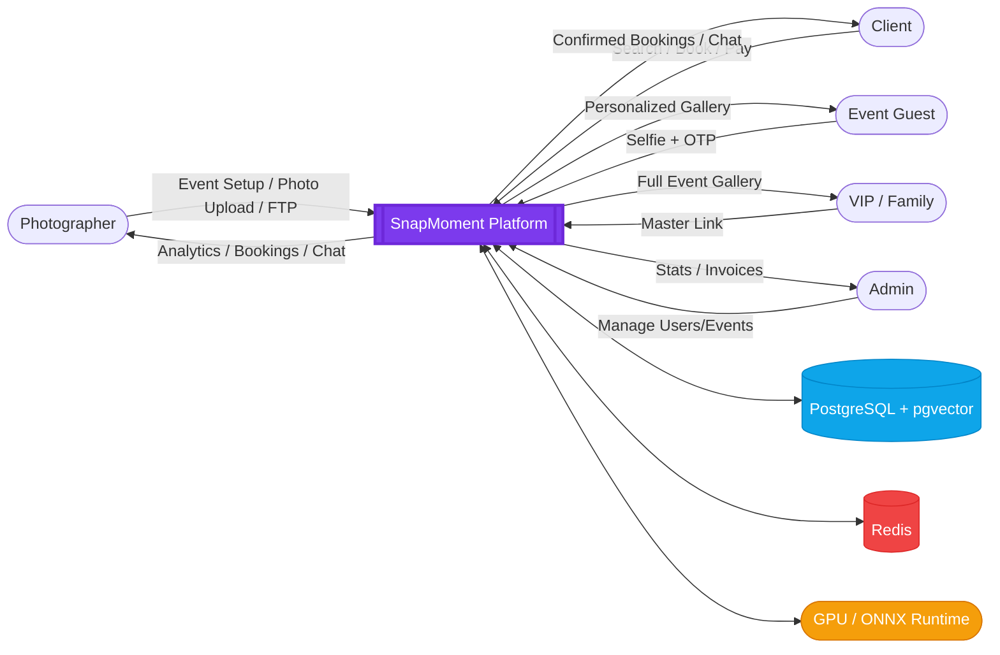

### 2. Internal Process Flow (Level 1 DFD)

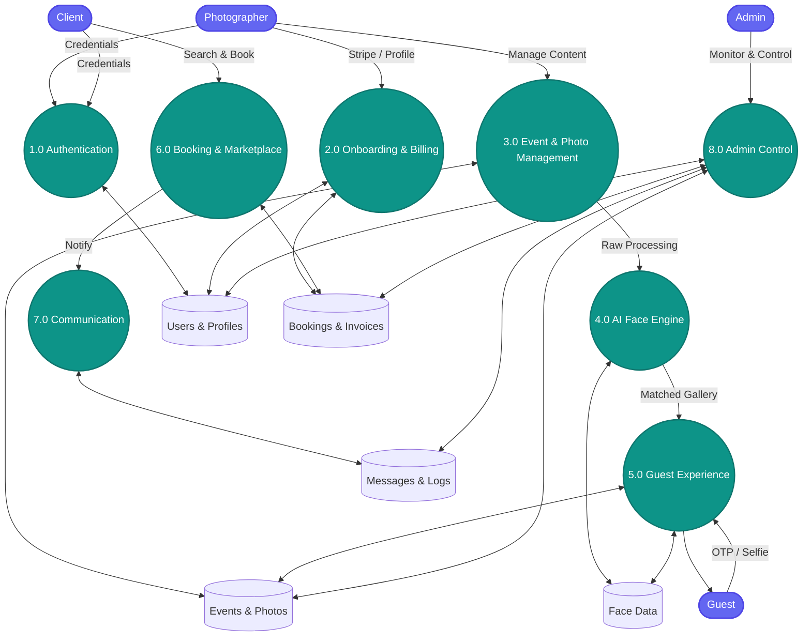

### 3. Internal Process Flow (Level 2 DFD)

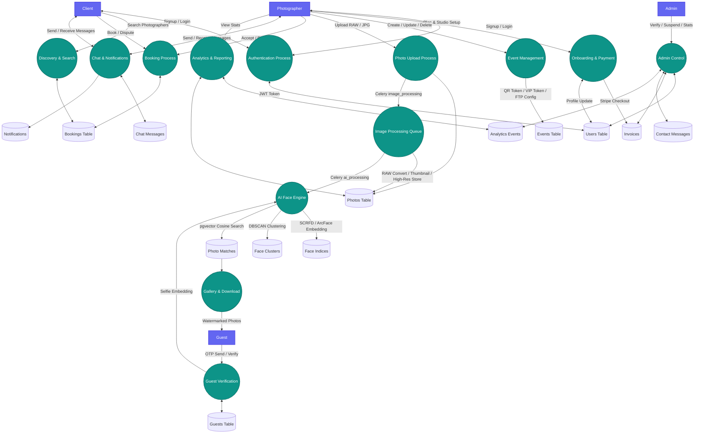

---

## Workflow Diagrams

### Workflow 1 — Photographer Onboarding & Subscription

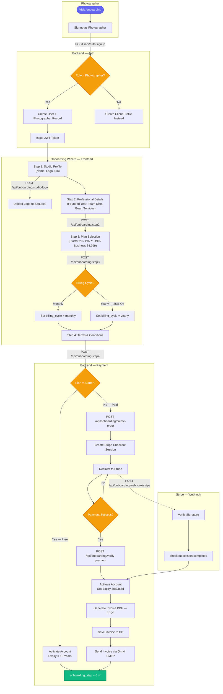

---

### Workflow 2 — Photo Upload & AI Processing Pipeline

```mermaid
flowchart TD
    subgraph Photographer
        P1([Select Event]) --> P2[Upload Photos\nJPG / CR2 / NEF / ARW]
    end

    subgraph "Backend — Photos Router"
        P2 -->|POST /api/photos/upload| P3[Save Original to\nS3 / Local Storage]
        P3 --> P4[Insert Photo Record\nstatus = processing]
        P4 --> P5[Dispatch Celery Task]
    end

    subgraph "Celery Worker — image_processing Queue"
        P5 -->|process_single_photo| Q1{Is RAW Format?}
        Q1 -->|Yes .cr2/.nef/.arw| Q2[rawpy.postprocess\nhalf_size=True\nLinear Debayer]
        Q1 -->|No .jpg/.png| Q3[PIL.Image.open]
        Q2 & Q3 --> Q4[EXIF Transpose — Fix Rotation]
        Q4 --> Q5[Generate High-Res JPG\n3600×3600 max, quality=85]
        Q5 --> Q6[Generate Thumbnail\n1080×1080, quality=75]
        Q6 --> Q7[Upload High-Res + Thumb\nto Storage]
        Q7 --> Q8[Update DB: s3_key,\nthumbnail_url, status=ready]
    end

    subgraph "Celery Worker — ai_processing Queue"
        Q8 -->|index_single_photo.delay| R1[Load Thumbnail Image\nvia cv2.imread]
        R1 --> R2["SCRFD Face Detection\n(det_10g.onnx)\nConfidence > 0.35"]
        R2 --> R3{Faces Found?}
        R3 -->|No| R4[Log Warning\nMark face_indexed=True\nfaces_count=0]
        R3 -->|Yes| R5["ArcFace Embedding\n(w600k_r100.onnx)\n512-D L2-Normalized Vector"]
        R5 --> R6[Insert FaceIndex Records\ninto pgvector Table]
        R6 --> R7["Smart Crop Generation\n1:1 Square + 9:16 Story"]
        R7 --> R8[Update Photo:\nface_indexed=True\nfaces_count=N\nhas_social_crops=True]
    end

    subgraph "Batch Re-Index — Full Event"
        R8 -.->|index_event_photos| S1[Fetch All Unindexed Photos]
        S1 --> S2[Batch Process — 5 at a time]
        S2 --> S3[Phase 2: DBSCAN Clustering\neps=0.42, metric=cosine]
        S3 --> S4[Compute Cluster Centroids\nL2-Normalized Mean]
        S4 --> S5[Save FaceCluster Records]
        S5 --> S6[Status: complete ✅]
    end

    style P1 fill:#6366f1,color:#fff,stroke:#4f46e5,stroke-width:2px
    style R3 fill:#f59e0b,color:#fff,stroke:#d97706,stroke-width:2px
    style Q1 fill:#f59e0b,color:#fff,stroke:#d97706,stroke-width:2px
    style S6 fill:#10b981,color:#fff,stroke:#059669,stroke-width:2px
    style R4 fill:#ef4444,color:#fff,stroke:#dc2626,stroke-width:2px
```

---

### Workflow 3 — Guest Face-Match & Gallery Access

```mermaid
flowchart TD
    subgraph "Guest — Mobile Browser"
        G1([Scan QR Code\nor Open VIP Link]) --> G2{Access Type?}
        G2 -->|QR Code| G3[Enter Phone + Name]
        G2 -->|VIP Token| G14[Auto-Login as VIP\n48h Access Token]
    end

    subgraph "Backend — OTP Verification"
        G3 -->|POST /api/guest/otp/send| H1[Rate Limit Check\nRedis TTL]
        H1 --> H2{Allowed?}
        H2 -->|No| H2X[429 Too Many Requests]
        H2 -->|Yes| H3[Generate 6-Digit OTP]
        H3 --> H4[Store in Redis\nTTL = 5 min]
        H4 --> H5{DEV_MODE?}
        H5 -->|Yes| H6[Log OTP to Console]
        H5 -->|No| H7[Send via MSG91 SMS]
        H6 & H7 --> H8[Guest Enters OTP]
        H8 -->|POST /api/guest/otp/verify| H9{OTP Valid?}
        H9 -->|No| H9X[400 Invalid OTP]
        H9 -->|Yes| H10[Upsert Guest Record]
        H10 --> H11[Issue Guest JWT\n24h Expiry]
    end

    subgraph "Guest — Selfie Capture"
        H11 & G14 --> I1["MediaPipe Face Mesh\nGuided Alignment\n(Frontend)"]
        I1 --> I2[Capture Selfie Photo]
        I2 -->|POST /api/guest/selfie| I3[Save to Temp File]
    end

    subgraph "Backend — AI Matching"
        I3 --> J1["extract_embedding()\nBuffalo_L Single-Face\nLargest Face, Score > 0.60"]
        J1 --> J2{Face Detected?}
        J2 -->|No| J2X[422 No Face Detected]
        J2 -->|Yes| J3[Upload Selfie to Storage]
        J3 --> J4[Save Embedding\nto Guest Record]
        J4 --> J5["pgvector Cosine Search\nFaceIndex.embedding\n.cosine_distance(selfie)\nORDER BY distance\nLIMIT 200"]
        J5 --> J6["Tiered Classification\n< 0.50 → Verified Match\n0.50-0.60 → Suggested"]
        J6 --> J7["Confidence Mapping\n0.0 → 100%\n0.50 → 90%\n0.60 → 15%"]
        J7 --> J8[Delete Old PhotoMatch\nRecords for Guest]
        J8 --> J9[Insert New PhotoMatch\nRecords]
    end

    subgraph "Guest — Gallery"
        J9 --> K1[GET /api/guest/gallery]
        G14 --> K1a["VIP: SELECT ALL Photos\nWhere event_id = X"]
        K1 --> K2["Display Matched Photos\nWith Confidence Scores"]
        K1a --> K2
        K2 --> K3{Download?}
        K3 -->|Single| K4["Apply Text Watermark\n'Captured by Studio Name'\nGET /download?format=original/1x1/9:16"]
        K3 -->|Bulk ZIP| K5["ZIP All Matched Photos\nEach Watermarked\nGET /gallery/download-all"]
        K3 -->|Report| K6["POST /gallery/id/report\nis_reported = True"]
    end

    style G1 fill:#6366f1,color:#fff,stroke:#4f46e5,stroke-width:2px
    style G2 fill:#f59e0b,color:#fff,stroke:#d97706,stroke-width:2px
    style H2 fill:#f59e0b,color:#fff,stroke:#d97706,stroke-width:2px
    style H9 fill:#f59e0b,color:#fff,stroke:#d97706,stroke-width:2px
    style J2 fill:#f59e0b,color:#fff,stroke:#d97706,stroke-width:2px
    style K3 fill:#f59e0b,color:#fff,stroke:#d97706,stroke-width:2px
    style K2 fill:#10b981,color:#fff,stroke:#059669,stroke-width:2px
```

---

### Workflow 4 — Client Booking & Photographer Response

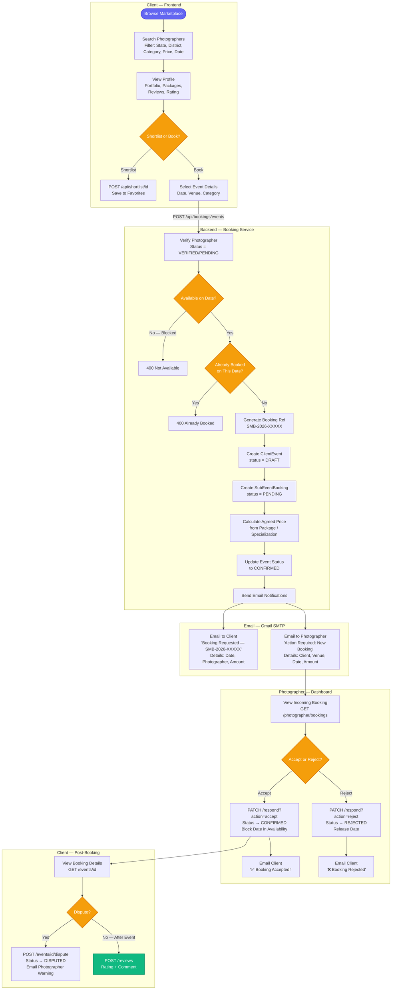

---

### Workflow 5 — Real-Time Chat & Notification System

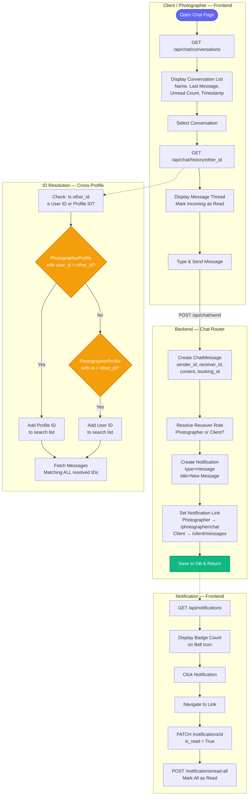

---

### Workflow 6 — Admin Control Panel

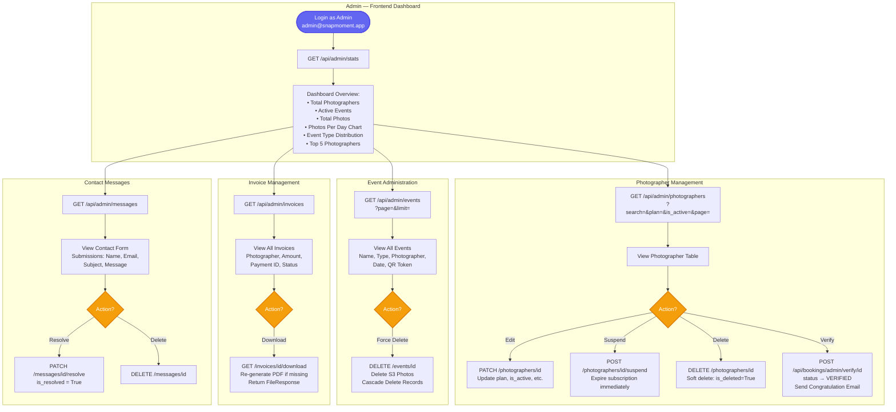

---

### Workflow 7 — Event Collaboration & Analytics

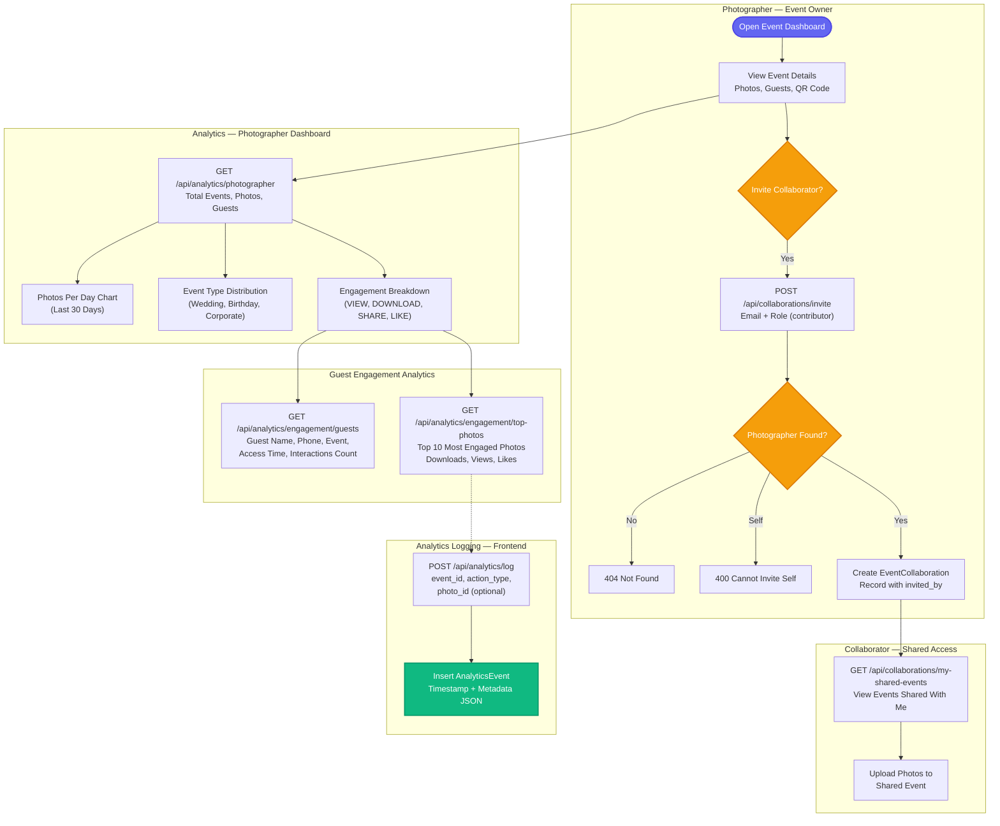

---

## Logical ER Diagram

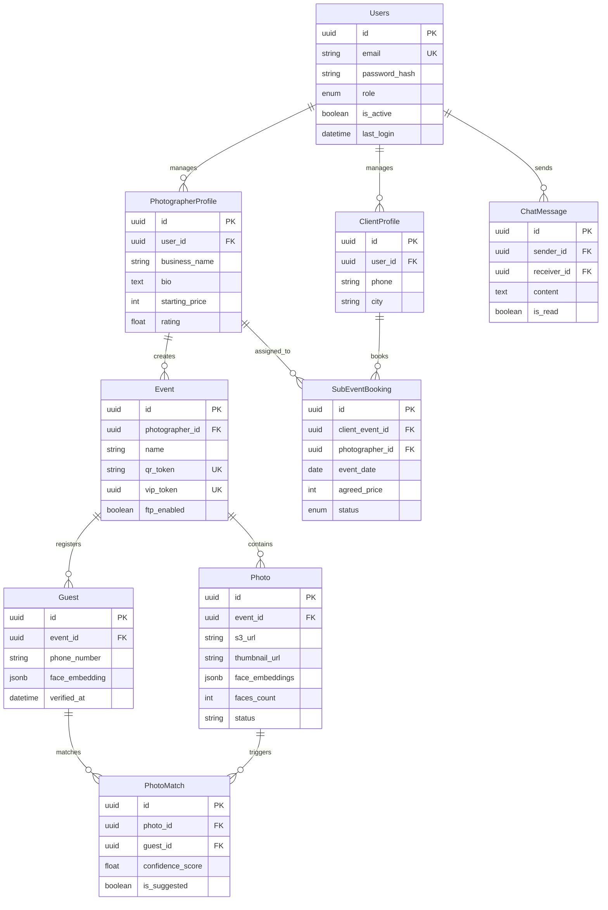

---

## Event Lifecycle

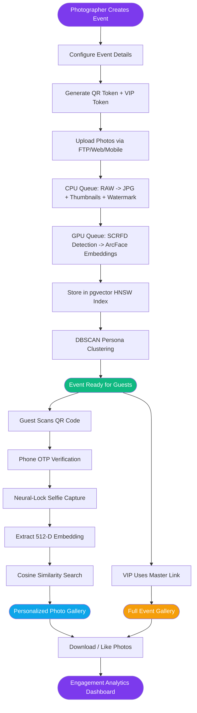

---

## Photo State Diagram

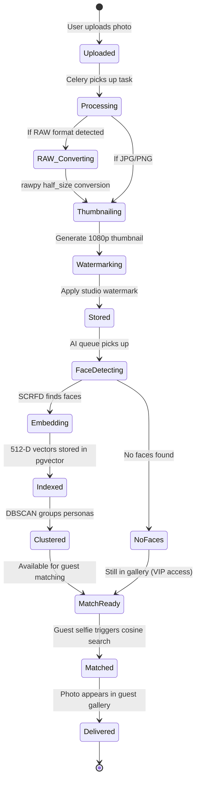

---

## 🔌 Complete API Reference

### Authentication (auth.py)
| Method | Endpoint | Purpose | Internal Logic |
|---|---|---|---|
| POST | /api/auth/photographer/signup | Register photographer | Bcrypt hashing -> User + Photographer record |
| POST | /api/auth/client/signup | Register client | Creates User + ClientProfile record |
| POST | /api/auth/login | Login | Credential check -> JWT stateless token |
| POST | /api/auth/admin/login | Admin login | Role check (must be admin) |
| GET | /api/auth/me | Current profile | Decodes JWT -> Fetches User detail |

### Events (events.py)
| Method | Endpoint | Purpose | Internal Logic |
|---|---|---|---|
| POST | /api/events | Create event | Generates QR token (short) + VIP token (UUID) |
| GET | /api/events | List events | Filter by photographer_id |
| GET | /api/events/{event_id} | Get single event | JSON response with photo stats |
| PATCH | /api/events/{event_id} | Update metadata | Partial update for name/date/location |
| DELETE | /api/events/{event_id} | Delete event | Cascade delete all photos + face data |
| GET | /api/events/public/{qr_token} | Public event view | Guest-facing event info via QR token |

### Photos (photos.py)
| Method | Endpoint | Purpose | Internal Logic |
|---|---|---|---|
| POST | /api/events/{id}/photos | Bulk upload | Local storage save -> Queue image_processing |
| GET | /api/events/{id}/photos | List photos | Fetches processed S3/local URLs |
| POST | /api/events/{id}/process | Start AI | Triggers Celery ai_processing queue |
| GET | /api/events/{id}/process/status | Process check | Returns % completion of face indexing |

### Guest Flow (guest.py)
| Method | Endpoint | Purpose | Internal Logic |
|---|---|---|---|
| POST | /api/guest/otp/send | Send OTP | Generates 6-digit code -> Stores in Redis |
| POST | /api/guest/otp/verify | Verify OTP | Matches Redis code -> Issues Guest JWT role |
| POST | /api/guest/selfie | Upload selfie | Extracts 512-D vector -> Cosine search in pgvector |
| GET | /api/guest/gallery | Get gallery | Filter photos where photo_match score < 0.65 |
| GET | /api/guest/vip/{vip_token} | VIP access | UUID check -> Bypasses selfie -> Returns all photos |
| GET | /api/guest/gallery/download-all | Download ZIP | Server-side ZIP creation of all matched files |
| POST | /api/guest/gallery/{photo_id}/report | Report photo | Sets is_reported=True -> Notifies Photographer |
| GET | /api/guest/gallery/{photo_id}/download | Single download | Streams individual photo file |

### Bookings (booking.py)
| Method | Endpoint | Purpose | Internal Logic |
|---|---|---|---|
| GET | /api/bookings/locations/states | List states | Unique state values from photographer profiles |
| GET | /api/bookings/locations/districts/{state} | List districts | Filter districts by selected state |
| GET | /api/bookings/photographers/search | Search photographers | Multi-param filter (city, category, price) |
| GET | /api/bookings/photographers/{id} | Photographer profile | Public bio + portfolio + average rating |
| GET | /api/bookings/photographers/{id}/packages | List packages | Available service packages for photographer |
| POST | /api/bookings/events | Create client event | Master event record for multi-day bookings |
| GET | /api/bookings/events | List client events | All events for authenticated client |
| GET | /api/bookings/events/{id} | Get event detail | Single client event with sub-events |
| POST | /api/bookings/events/{id}/book | Book sub-event | Creates SubEventBooking + Notifies Photographer |
| POST | /api/bookings/events/{booking_id}/dispute | Dispute booking | Flags booking for admin review |
| PUT | /api/bookings/photographer/availability | Set availability | Bulk update photographer calendar dates |
| GET | /api/bookings/photographer/bookings | My bookings | List all bookings for authenticated photographer |
| GET | /api/bookings/photographer/clients/{client_id} | Client info | Fetch client details for booked photographer |
| PATCH | /api/bookings/photographer/bookings/{booking_id}/respond | Accept/Reject | Status update -> Triggers Client Notification |
| DELETE | /api/bookings/photographer/bookings/{booking_id} | Cancel booking | Photographer-initiated cancellation |
| GET | /api/bookings/admin/pending | Admin queue | List profiles with status=pending |
| POST | /api/bookings/admin/verify/{id} | Admin verify | status=verified -> Email notification |

### Photographer Profile (photographer.py)
| Method | Endpoint | Purpose | Internal Logic |
|---|---|---|---|
| GET | /api/photographer/profile | Get own profile | Fetches linked PhotographerProfile record |
| PATCH | /api/photographer/profile | Update profile | Updates bio, studio_name, pricing |
| POST | /api/photographer/portfolio/upload | Upload portfolio | Multi-part upload to storage |
| DELETE | /api/photographer/portfolio | Delete portfolio image | Removes file from storage |

### Specializations (specialization.py)
| Method | Endpoint | Purpose | Internal Logic |
|---|---|---|---|
| GET | /api/photographer/specializations | List own | Fetches specializations for authenticated photographer |
| POST | /api/photographer/specializations | Add new | Creates category + base_price record |
| PUT | /api/photographer/specializations/{id} | Update | Modifies category/price |
| DELETE | /api/photographer/specializations/{id} | Remove | Deletes specialization |

### Onboarding (onboarding.py)
| Method | Endpoint | Purpose | Internal Logic |
|---|---|---|---|
| POST | /api/onboarding/step2 | Studio details | Sets studio_name, founded_year, logo |
| POST | /api/onboarding/step3 | Gear & experience | Sets camera models, team_size, experience_level |
| POST | /api/onboarding/step4 | Complete onboarding | Finalizes photographer setup |
| POST | /api/onboarding/create-order | Payment order | Creates subscription payment order |
| POST | /api/onboarding/verify-payment | Verify payment | Confirms subscription activation |
| POST | /api/onboarding/studio-logo | Upload logo | Stores studio branding image |

### Chat (chat.py)
| Method | Endpoint | Purpose | Internal Logic |
|---|---|---|---|
| GET | /api/chat/conversations | List conversations | Fetches unique sender/receiver pairs |
| GET | /api/chat/history/{userId} | Message history | Chat log with specific user |
| POST | /api/chat/send | Send message | Saves record -> Triggers notification |

### Notifications (notification.py)
| Method | Endpoint | Purpose | Internal Logic |
|---|---|---|---|
| GET | /api/notifications | Get all | Fetches unread message/booking/system alerts |
| PATCH | /api/notifications/{id} | Mark read/unread | Toggle notification read status |
| POST | /api/notifications/read-all | Mark all read | Bulk read update |
| DELETE | /api/notifications/{id} | Delete | Remove notification |

### Shortlist / Favorites (shortlist.py)
| Method | Endpoint | Purpose | Internal Logic |
|---|---|---|---|
| GET | /api/shortlist | Get shortlisted | List of favorited photographer profiles |
| POST | /api/shortlist/{photographerId} | Add to shortlist | Creates PhotographerFavorite record |
| DELETE | /api/shortlist/{photographerId} | Remove from shortlist | Deletes favorite record |

### Client Profile (client.py)
| Method | Endpoint | Purpose | Internal Logic |
|---|---|---|---|
| GET | /api/client/profile | Get client profile | Fetches ClientProfile for authenticated user |
| PATCH | /api/client/profile | Update profile | Updates phone, city, personal info |

### Collaboration (collaboration.py)
| Method | Endpoint | Purpose | Internal Logic |
|---|---|---|---|
| POST | /api/events/{id}/collaborators | Add collaborator | Creates EventCollaboration record |
| GET | /api/events/{id}/collaborators | List collaborators | All photographers on an event |
| DELETE | /api/events/{id}/collaborators/{photographerId} | Remove collaborator | Deletes collaboration |

### Admin (admin.py)
| Method | Endpoint | Purpose | Internal Logic |
|---|---|---|---|
| GET | /api/admin/photographers | List photographers | All photographer accounts |
| PATCH | /api/admin/photographers/{id} | Update photographer | Admin-level profile edits |
| DELETE | /api/admin/photographers/{id} | Delete photographer | Removes photographer account |
| POST | /api/admin/photographers/{id}/suspend | Suspend | Deactivates photographer |
| GET | /api/admin/events | List all events | Platform-wide event listing |
| DELETE | /api/admin/events/{id} | Delete event | Admin-level event removal |
| GET | /api/admin/stats | Platform statistics | Aggregates system-wide usage metrics |
| GET | /api/admin/invoices | List invoices | All payment records |
| GET | /api/admin/invoices/{id}/download | Download PDF | Generates invoice PDF |
| GET | /api/admin/messages | Contact messages | List contact form submissions |
| PATCH | /api/admin/messages/{id}/resolve | Resolve message | Marks message as handled |
| DELETE | /api/admin/messages/{id} | Delete message | Removes contact message |

### Analytics (analytics.py)
| Method | Endpoint | Purpose | Internal Logic |
|---|---|---|---|
| GET | /api/analytics/photographer | Photographer analytics | Engagement stats (likes, downloads, matched guests) |

### Contact & Health
| Method | Endpoint | Purpose | Internal Logic |
|---|---|---|---|
| POST | /api/contact | Submit contact form | Creates Message record for admin review |
| GET | /api/health | System health check | Returns service status |

---

## 🗄️ Database Tables (Full Schema)

#### `users`
- `id` (UUID, PK)
- `email` (UK)
- `role` (ENUM)

#### `photographers`
- `id` (UUID, PK)
- `studio_name`
- `watermark_url`

#### `events`
- `id` (UUID, PK)
- `photographer_id` (FK)
- `qr_token` (UK)
- `vip_token` (UK)

#### `photos`
- `id` (UUID, PK)
- `event_id` (FK)
- `s3_url`
- `faces_count`

#### `guests`
- `id` (UUID, PK)
- `phone_number`
- `face_embedding` (JSONB)

#### `photo_matches`
- `photo_id` (FK)
- `guest_id` (FK)
- `confidence_score`

#### `face_indices`
- `embedding` (VECTOR 512)
- `photo_id` (FK)

#### `face_clusters`
- `centroid` (VECTOR 512)
- `photo_ids` (JSON)

#### `photographer_profiles`
- `user_id` (FK)
- `business_name`
- `starting_price`

#### `photographer_packages`
- `photographer_id` (FK)
- `price`
- `photos_delivered`

#### `sub_event_bookings`
- `client_event_id` (FK)
- `photographer_id` (FK)
- `status` (ENUM)

#### `client_profiles`
- `user_id` (FK)
- `phone`
- `city`

#### `client_events`
- `client_id` (FK)
- `status` (ENUM)

#### `invoices`
- `photographer_id` (FK)
- `amount`

#### `chat_messages`
- `sender_id` (FK)
- `receiver_id` (FK)
- `content`

#### `notifications`
- `user_id` (FK)
- `type` (ENUM)
- `title` (VARCHAR)
- `content` (TEXT)
- `link` (VARCHAR, nullable)
- `is_read` (BOOLEAN)

#### `photographer_specializations`
- `id` (UUID, PK)
- `photographer_id` (FK -> photographer_profiles)
- `category` (VARCHAR)
- `sub_category` (VARCHAR)
- `base_price` (INTEGER)
- `description` (TEXT)

#### `photographer_availability`
- `id` (UUID, PK)
- `photographer_id` (FK -> photographer_profiles)
- `date` (DATE)
- `is_available` (BOOLEAN)

#### `photographer_reviews`
- `id` (UUID, PK)
- `sub_event_booking_id` (FK)
- `client_id` (FK -> client_profiles)
- `photographer_id` (FK -> photographer_profiles)
- `rating` (INTEGER, 1-5)
- `review_text` (TEXT)

#### `photographer_favorites`
- `id` (UUID, PK)
- `client_id` (FK -> client_profiles)
- `photographer_id` (FK -> photographer_profiles)

#### `event_collaborations`
- `id` (UUID, PK)
- `event_id` (FK -> events)
- `photographer_id` (FK -> photographers)
- `role` (VARCHAR: viewer, contributor, admin)
- `invited_by` (FK -> photographers)

#### `messages` (Contact Form)
- `id` (UUID, PK)
- `name` (VARCHAR)
- `email` (VARCHAR)
- `subject` (VARCHAR)
- `message` (TEXT)
- `is_resolved` (BOOLEAN)

---

## 📖 Comprehensive Data Dictionary (75+ Attributes)

| Table | Column | Type | Description |
|---|---|---|---|
| users | email | VARCHAR | Login identifier |
| users | role | ENUM | admin, photog, client |
| events | qr_token | VARCHAR | Guest access token |
| events | vip_token | UUID | Full gallery token |
| photos | face_indexed | BOOLEAN | AI pipeline status |
| guests | face_embedding | JSONB | Biometric vector |
| photo_matches | confidence_score | FLOAT | Similarity score |
| profiles | starting_price | INTEGER | Base cost INR |
| bookings | status | ENUM | pending, confirmed |
| chat | is_read | BOOLEAN | Message status |
| notifications | type | VARCHAR | message, booking, system |
| notifications | is_read | BOOLEAN | Alert read status |
| client_profiles | phone | VARCHAR | Client contact number |
| client_profiles | city | VARCHAR | Client location |
| client_profiles | state | VARCHAR | Client state |
| client_profiles | district | VARCHAR | Client district |
| client_events | status | ENUM | draft, confirmed, completed, cancelled |
| client_events | event_category | VARCHAR | Event type |
| photographer_specializations | category | VARCHAR | Service category |
| photographer_specializations | base_price | INTEGER | Category base price |
| photographer_packages | name | VARCHAR | Package title |
| photographer_packages | price | INTEGER | Package cost |
| photographer_packages | duration_hours | INTEGER | Event coverage length |
| photographer_packages | photos_delivered | INTEGER | Delivery quantity |
| photographer_packages | turnaround_days | INTEGER | Delivery speed |
| photographer_packages | includes_reels | BOOLEAN | Reel production |
| photographer_packages | includes_drone | BOOLEAN | Aerial coverage |
| photographer_availability | date | DATE | Calendar date |
| photographer_availability | is_available | BOOLEAN | Availability flag |
| photographer_reviews | rating | INTEGER | 1-5 star score |
| photographer_reviews | review_text | TEXT | Client feedback |
| photographer_favorites | client_id | UUID (FK) | Shortlisting client |
| photographer_favorites | photographer_id | UUID (FK) | Shortlisted studio |
| event_collaborations | role | VARCHAR | viewer, contributor, admin |
| messages | name | VARCHAR | Contact form sender |
| messages | is_resolved | BOOLEAN | Admin resolution flag |
| face_indices | embedding | VECTOR(512) | pgvector ArcFace data |
| face_clusters | centroid | VECTOR(512) | Cluster mean vector |
| face_clusters | cluster_label | INTEGER | DBSCAN group ID |
| analytics_events | action_type | VARCHAR | like, download, view |
| invoices | amount | FLOAT | Total billing amount |
| invoices | status | VARCHAR | Payment state |
| invoices | pdf_url | VARCHAR | Invoice PDF path |

---

## 🏗️ Project Blueprint

### Frontend Page Map
- **Public**: Home, About, Pricing, Contact, Demo, Login, Signup, Search
- **Client**: Dashboard, Events, Messages, Favorites, Profile
- **Photographer**: Dashboard, Events, Upload, Bookings, Chat, Analytics, Profile
- **Guest**: Landing, Selfie, Gallery, VIP

### File Structure
- `backend/app/models/`: 22 model classes across 17 files
- `backend/app/routers/`: 15 API modules
- `frontend/src/pages/`: 40+ React pages

### Detailed Directory Tree
```text
SnapMoment/
├── backend/
│   ├── app/
│   │   ├── models/        # SQLAlchemy Database Models (22 entities)
│   │   ├── routers/       # FastAPI Route Modules (15 modules)
│   │   ├── schemas/       # Pydantic Data Schemas
│   │   ├── services/      # Business Logic (AI Engine, Booking Logic, S3/FTP)
│   │   ├── tasks/         # Celery Background Tasks (CPU/GPU Queues)
│   │   ├── utils/         # Shared helpers (Geo-data, Validators)
│   │   ├── config.py      # Settings & Environment Config
│   │   ├── database.py    # Async SQLAlchemy Engine & Init
│   │   └── main.py        # FastAPI Entry Point & Router Mounting
│   ├── Dockerfile         # Python 3.10 Build Context
│   └── requirements.txt   # Backend dependencies
├── frontend/
│   ├── src/
│   │   ├── components/    # Reusable UI Components (Shared, Chat, Booking)
│   │   ├── hooks/         # Custom React Hooks (Auth, API)
│   │   ├── lib/           # API Client (Axios) & Global Utilities
│   │   ├── pages/         # 47 React Pages (Admin, Photog, Client, Guest)
│   │   ├── store/         # Zustand State Management (Auth, UI)
│   │   ├── App.tsx        # Application Router & Layouts
│   │   └── index.css      # Global Design System (Vanilla CSS)
│   ├── Dockerfile         # Vite/React Build Context
│   └── package.json       # Frontend dependencies
├── scripts/               # Maintenance & Deployment helper scripts
├── docker-compose.yml     # 6-container Orchestration (FE, BE, Celery, DB, Redis)
├── .env.example           # Environment template
└── README.md              # Master Blueprint & Documentation
```

---

## 🧭 User Role Journey Map

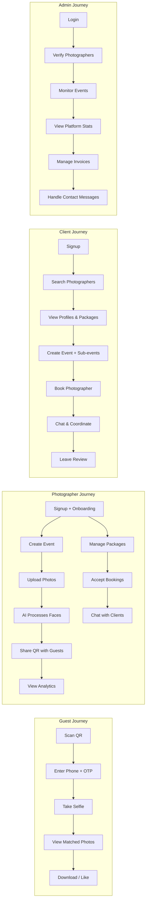

---

## 🐳 Docker Deployment Architecture

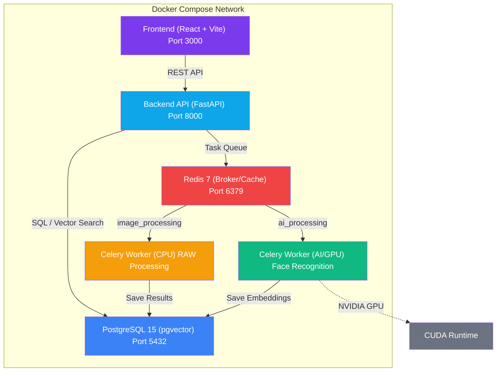

---

## 🔬 AI Face Matching — Sequence Diagram

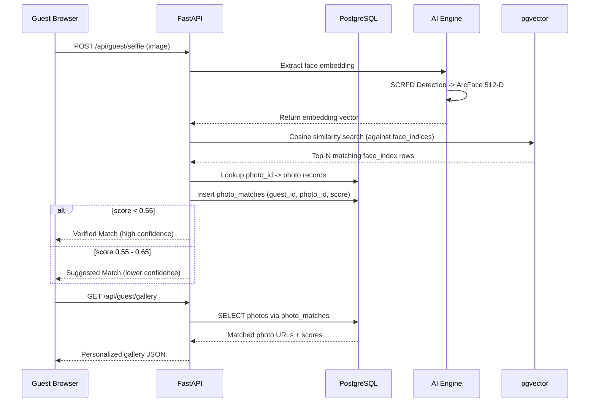

---

## 📋 Status and Enum Reference

| Enum Name | Values | Used In | Description |
|---|---|---|---|
| **UserRole** | `admin`, `photographer`, `client` | `users.role` | Platform access level |
| **PhotographerStatus** | `pending`, `verified`, `rejected` | `photographer_profiles.status` | Admin verification state |
| **EventStatus** | `draft`, `confirmed`, `completed`, `cancelled` | `client_events.status` | Client event lifecycle |
| **BookingStatus** | `pending`, `confirmed`, `completed`, `cancelled`, `rejected`, `disputed` | `sub_event_bookings.status` | Booking lifecycle |
| **PaymentStatus** | `pending`, `paid`, `refunded` | Invoices / bookings | Payment state |
| **PhotoStatus** | `processing`, `ready`, `error` | `photos.status` | AI pipeline state |
| **EventType** | `wedding`, `birthday`, `college`, `corporate`, `anniversary`, `other` | `events.type` | Event classification |
| **Plan** | `free`, `pro`, `studio` | `photographers.plan` | Subscription tier |

### AI Matching Thresholds
| Score Range | Classification | Action |
|---|---|---|
| **< 0.55** | Precision Match | Shown as verified match in gallery |
| **0.55 - 0.65** | Suggested Match | Shown as "similar" with lower confidence |
| **> 0.65** | No Match | Not shown to guest |

---

## 📊 Booking Lifecycle — Sequence Diagram

The complete flow from client search to post-event review:

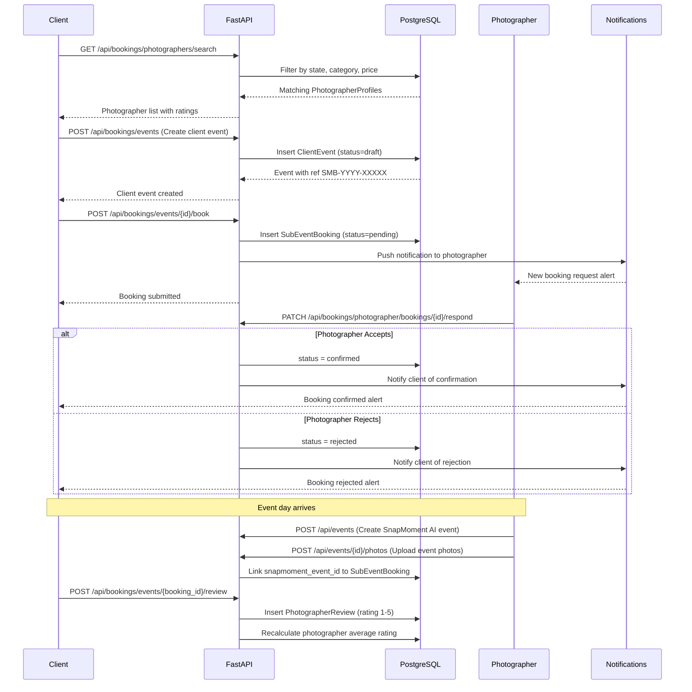

---

## 🔐 Authentication & JWT Flow

How authentication and role-based authorization work across the platform:

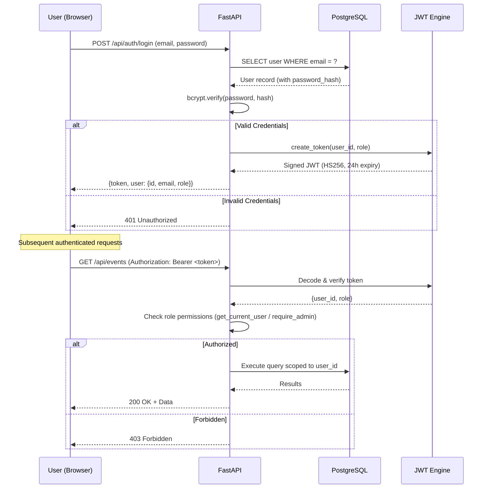

---

## 🔒 API Authentication Matrix

Which role can access which router modules:

| Router Module | Public | Guest (OTP) | Client (JWT) | Photographer (JWT) | Admin (JWT) |
|---|---|---|---|---|---|
| **auth** (signup/login) | Yes | -- | -- | -- | -- |
| **auth** (/me) | -- | -- | Yes | Yes | Yes |
| **events** | -- | -- | -- | Yes | -- |
| **photos** | -- | -- | -- | Yes | -- |
| **guest** (OTP/selfie) | Yes | -- | -- | -- | -- |
| **guest** (gallery) | -- | Yes | -- | -- | -- |
| **booking** (search/profiles) | Yes | -- | Yes | -- | -- |
| **booking** (create/book) | -- | -- | Yes | -- | -- |
| **booking** (respond/manage) | -- | -- | -- | Yes | -- |
| **booking** (admin verify) | -- | -- | -- | -- | Yes |
| **photographer** (profile) | -- | -- | -- | Yes | -- |
| **specialization** | -- | -- | -- | Yes | -- |
| **onboarding** | -- | -- | -- | Yes | -- |
| **chat** | -- | -- | Yes | Yes | -- |
| **notifications** | -- | -- | Yes | Yes | Yes |
| **shortlist** | -- | -- | Yes | -- | -- |
| **client** | -- | -- | Yes | -- | -- |
| **collaboration** | -- | -- | -- | Yes | -- |
| **admin** (all) | -- | -- | -- | -- | Yes |
| **analytics** | -- | -- | -- | Yes | -- |
| **contact** (submit form) | Yes | -- | -- | -- | -- |
| **health** | Yes | -- | -- | -- | -- |

---

## 🔗 Complete Entity Relationship Map (All 22 Entities)

Full relationship map showing every table and foreign key connection:

```mermaid
erDiagram
    users {
        uuid id PK
        string email UK
        string password_hash
        string full_name
        enum role
        boolean is_active
        boolean is_verified
        datetime last_login
    }

    photographers {
        uuid id PK
        string full_name
        string email UK
        string studio_name
        string watermark_url
        string plan
        int onboarding_step
        string team_size
        string primary_gear
    }

    events {
        uuid id PK
        uuid photographer_id FK
        string name
        string type
        string qr_token UK
        uuid vip_token UK
        string location
        boolean ftp_enabled
        string ftp_password
    }

    photos {
        uuid id PK
        uuid event_id FK
        string s3_url
        string thumbnail_url
        string status
        boolean face_indexed
        jsonb face_embeddings
        int faces_count
    }

    guests {
        uuid id PK
        uuid event_id FK
        string phone_number
        string selfie_s3_key
        jsonb face_embedding
        datetime verified_at
    }

    photo_matches {
        uuid id PK
        uuid photo_id FK
        uuid guest_id FK
        float confidence_score
        boolean is_suggested
        boolean is_reported
    }

    face_indices {
        uuid id PK
        uuid photo_id FK
        uuid event_id
        vector_512 embedding
    }

    face_clusters {
        uuid id PK
        uuid event_id
        int cluster_label
        vector_512 centroid
        json photo_ids
        int face_count
    }

    photographer_profiles {
        uuid id PK
        uuid user_id FK
        string business_name
        text bio
        int starting_price
        float rating
        enum status
        string service_states
        int travel_range_km
    }

    photographer_packages {
        uuid id PK
        uuid photographer_id FK
        string name
        int price
        int duration_hours
        int photos_delivered
        int turnaround_days
        boolean includes_drone
    }

    photographer_specializations {
        uuid id PK
        uuid photographer_id FK
        string category
        string sub_category
        int base_price
    }

    photographer_availability {
        uuid id PK
        uuid photographer_id FK
        date date
        boolean is_available
    }

    photographer_reviews {
        uuid id PK
        uuid sub_event_booking_id FK
        uuid client_id FK
        uuid photographer_id FK
        int rating
        text review_text
    }

    photographer_favorites {
        uuid id PK
        uuid client_id FK
        uuid photographer_id FK
    }

    client_profiles {
        uuid id PK
        uuid user_id FK
        string phone
        string state
        string district
        string city
    }

    client_events {
        uuid id PK
        uuid client_id FK
        string event_ref UK
        string event_category
        string event_title
        enum status
        int total_budget
    }

    sub_event_bookings {
        uuid id PK
        uuid client_event_id FK
        uuid photographer_id FK
        uuid package_id FK
        date event_date
        int agreed_price
        enum status
        uuid snapmoment_event_id FK
    }

    chat_messages {
        uuid id PK
        uuid sender_id FK
        uuid receiver_id FK
        text content
        boolean is_read
        uuid booking_id
    }

    notifications {
        uuid id PK
        uuid user_id FK
        string type
        string title
        text content
        boolean is_read
    }

    event_collaborations {
        uuid id PK
        uuid event_id FK
        uuid photographer_id FK
        string role
        uuid invited_by FK
    }

    analytics_events {
        uuid id PK
        uuid event_id FK
        uuid photographer_id FK
        uuid guest_id FK
        string action_type
        jsonb metadata
    }

    invoices {
        uuid id PK
        uuid photographer_id FK
        string order_id UK
        float amount
        string status
        string pdf_url
    }

    messages {
        uuid id PK
        string name
        string email
        string subject
        text message
        boolean is_resolved
    }

    users ||--o{ photographer_profiles : "manages"
    users ||--o{ client_profiles : "manages"
    users ||--o{ chat_messages : "sends"
    users ||--o{ notifications : "receives"

    photographers ||--o{ events : "creates"
    photographers ||--o{ invoices : "billed"
    photographers ||--o{ event_collaborations : "collaborates"

    events ||--o{ photos : "contains"
    events ||--o{ guests : "registers"
    events ||--o{ face_clusters : "groups"
    events ||--o{ event_collaborations : "shares"
    events ||--o{ analytics_events : "tracks"

    photos ||--o{ face_indices : "indexed"
    photos ||--o{ photo_matches : "matched"

    guests ||--o{ photo_matches : "receives"
    guests ||--o{ analytics_events : "interacts"

    photographer_profiles ||--o{ photographer_packages : "offers"
    photographer_profiles ||--o{ photographer_specializations : "specializes"
    photographer_profiles ||--o{ photographer_availability : "calendar"
    photographer_profiles ||--o{ photographer_reviews : "reviewed"
    photographer_profiles ||--o{ photographer_favorites : "shortlisted"
    photographer_profiles ||--o{ sub_event_bookings : "assigned"

    client_profiles ||--o{ client_events : "creates"
    client_profiles ||--o{ photographer_reviews : "writes"
    client_profiles ||--o{ photographer_favorites : "favorites"

    client_events ||--o{ sub_event_bookings : "contains"

    sub_event_bookings ||--o{ photographer_reviews : "reviewed"
```

---

## ⚙️ Celery Task Pipeline

The dual-queue background processing architecture:

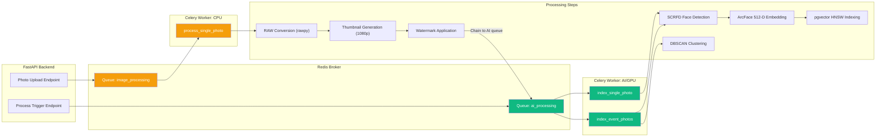

### Task Details

| Task Name | Queue | Concurrency | Purpose |
|---|---|---|---|
| `process_single_photo` | `image_processing` | 4 workers | RAW conversion, thumbnailing, watermark |
| `index_single_photo` | `ai_processing` | 1 worker | SCRFD detection + ArcFace embedding + pgvector insert |
| `index_event_photos` | `ai_processing` | 1 worker | Batch face indexing + DBSCAN clustering for full event |

---

## 🌐 Environment Variables Reference

All configuration variables required to run the platform:

| Variable | Required | Default | Description |
|---|---|---|---|
| `DATABASE_URL` | Yes | `postgresql+asyncpg://...localhost:5432/snapmoment` | PostgreSQL connection string |
| `REDIS_URL` | Yes | `redis://localhost:6379/0` | Redis broker URL |
| `JWT_SECRET_KEY` | **Yes** | -- | Secret for signing JWT tokens |
| `JWT_ALGORITHM` | No | `HS256` | Token signing algorithm |
| `JWT_EXPIRE_HOURS` | No | `24` | Token expiry duration |
| `USE_LOCAL_STORAGE` | No | `True` | Use local disk vs S3 |
| `LOCAL_STORAGE_PATH` | No | `./uploads` | Local file storage directory |
| `LOCAL_STORAGE_BASE_URL` | No | `http://localhost:8000/uploads` | Public URL prefix for uploads |
| `AWS_ACCESS_KEY_ID` | S3 only | -- | AWS S3 credentials |
| `AWS_SECRET_ACCESS_KEY` | S3 only | -- | AWS S3 credentials |
| `AWS_S3_BUCKET` | S3 only | `snapmoment-photos` | S3 bucket name |
| `AWS_REGION` | S3 only | `ap-south-1` | AWS region |
| `MSG91_AUTH_KEY` | Prod only | -- | SMS OTP service key |
| `DEV_MODE` | No | `True` | Enables dev shortcuts (OTP bypass) |
| `STRIPE_SECRET_KEY` | Payments | -- | Stripe payment processing |
| `STRIPE_PUBLIC_KEY` | Payments | -- | Stripe frontend key |
| `STRIPE_WEBHOOK_SECRET` | Payments | -- | Stripe event verification |
| `ADMIN_EMAIL` | **Yes** | `admin@snapmoment.app` | Default admin account |
| `ADMIN_PASSWORD` | **Yes** | -- | Default admin password |
| `SMTP_HOST` | Email | `smtp.gmail.com` | SMTP server |
| `SMTP_PORT` | Email | `587` | SMTP port |
| `SMTP_USER` | Email | -- | Gmail address |
| `SMTP_PASS` | Email | -- | Gmail app password |
| `FRONTEND_URL` | No | `http://localhost:3000` | Frontend origin URL |
| `CORS_ORIGINS` | No | `http://localhost:3000,http://localhost:5173` | Allowed CORS origins |
| `S3_PUBLIC_DOMAIN` | S3 only | -- | Custom CDN domain for S3 |
| `POSTGRES_USER` | Docker | `snapmoment` | Docker Compose DB user |
| `POSTGRES_PASSWORD` | Docker | -- | Docker Compose DB password |
| `POSTGRES_DB` | Docker | `snapmoment` | Docker Compose DB name |
| `VITE_API_URL` | Frontend | `http://localhost:8000` | Backend API URL for React |

---

## Team
- **Joel Jose Varghese** - CTO & Founder
- **Nandini Sinha** - CPO & Co-Founder
- **Manish Kumar Kaushik** - CEO
