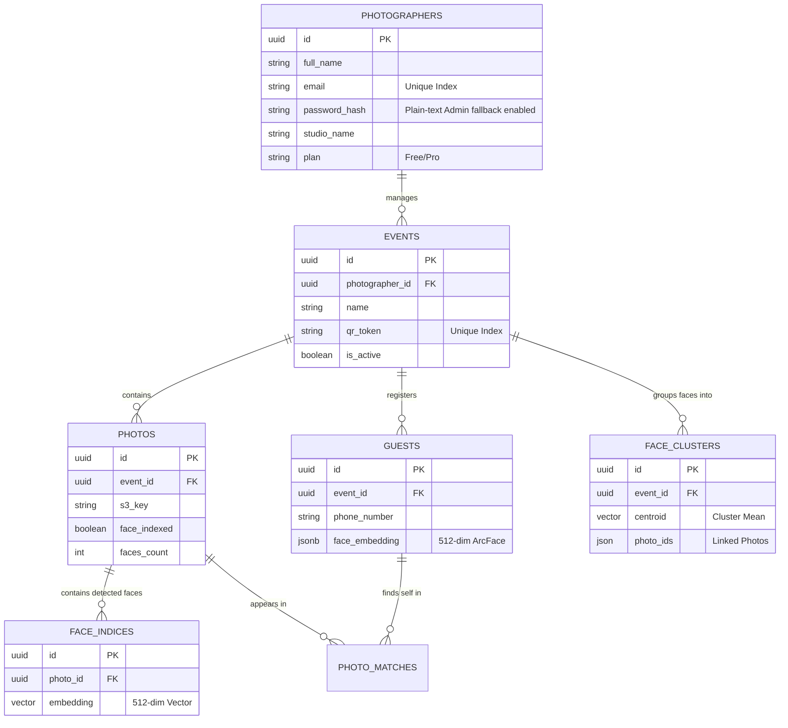
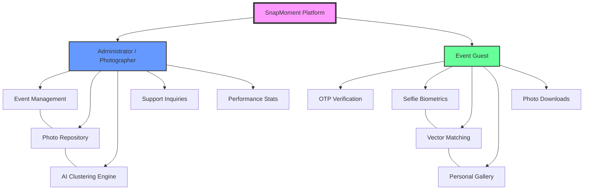
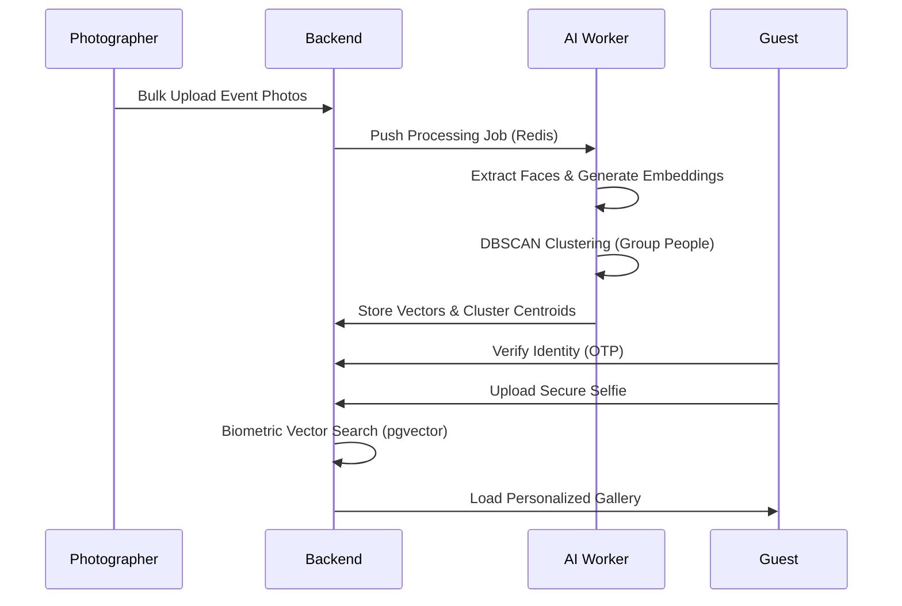
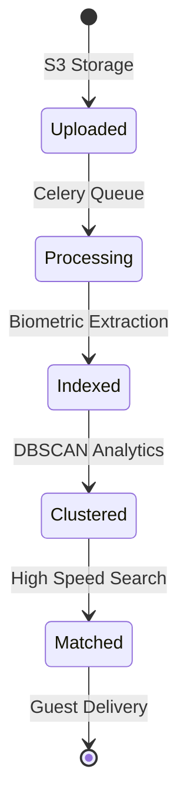

# SnapMoment 📸

[](https://fastapi.tiangolo.com/)
[](https://reactjs.org/)
[](https://github.com/serengil/deepface)
[](https://www.docker.com/)

> **Building for the moments that matter most.**  
> SnapMoment is an AI-powered event photo delivery platform that uses facial recognition to instantly deliver personalized galleries to guests. No more shared drives. No more manual searching.

---

## 🌟 Overview

SnapMoment was born from a simple frustration: why do event photos take days (or weeks) to arrive, often buried in a shared drive with thousands of strangers? We've built a seamless, AI-driven bridge between photographers' cameras and guests' heartbeats.

### 🎥 Demo / Live Link
- **Live Demo**: [https://snapmoment.app/demo](https://snapmoment.app/demo) *(Placeholder)*
- **Video Walkthrough**: [Link to Video](https://youtube.com/...) *(Placeholder)*

---

## ✨ Features

- **🚀 Instant Delivery**: Photos reach guests in under 30 seconds of AI matching.
- **🎯 99.8% Accuracy**: Powered by the **ArcFace** deep learning model.
- **📱 Zero Friction**: No app download required. Scan QR -> Verify -> Receive.
- **🔒 Privacy First**: Selfies are processed in memory and deleted immediately. We never store raw guest facial data.
- **📊 Pro Dashboard**: Advanced analytics for photographers to track event engagement.
- **🌊 Dynamic Design**: A premium, responsive UI featuring glassmorphism and smooth animations.

---

## 🛠️ Tech Stack

### Frontend
- **Framework**: React 18 (Vite)
- **Biometrics**: MediaPipe Tasks Vision (Real-time Detection)
- **Styling**: Tailwind CSS, Vanilla CSS (Design Tokens)
- **Animations**: Framer Motion
- **Icons**: Lucide React
- **State Management**: Zustand
- **Data Fetching**: TanStack Query (React Query)

### Backend
- **Framework**: FastAPI (Python 3.10+)
- **Async ORM**: SQLAlchemy 2.0 (with asyncpg)
- **Background Tasks**: Celery + Redis
- **Clustering**: Scikit-Learn (DBSCAN)
- **Database**: PostgreSQL 15 + pgvector (HNSW Indexing)
- **Authentication**: JWT (OTP-based sessions)

### AI & Computer Vision
- **Core Engine**: DeepFace
- **Biometric Model**: ArcFace (ResNet-100)
- **Real-time Detection**: MediaPipe BlazeFace (Frontend) / RetinaFace (Backend)
- **Vector Search**: Cosine Similarity via pgvector
- **Logic**: Two-Stage Matching (Fast Centroid + Exhaustive Fallback)

---

## 📐 Systems Architecture & Logic

### 1. Database Schema (High-Fidelity ERD)


### 2. Object Diagram (Hierarchy & Interaction)


### 3. Event Lifecycle (Sequence Diagram)


### 4. Photo Status (State Diagram)


---

## 🔄 How It Works (Workflow)

### For Photographers
1. **Create Event**: Set up a new event (Wedding, Corporate, etc.) in the dashboard.
2. **Bulk Upload**: Upload hundreds of photos at once. Click **"Process AI"**.
3. **Face Indexing**: The Celery worker runs the ArcFace engine to extract and index face embeddings for every person in every photo.
4. **Share QR**: Print or display the unique event QR code.

### For Guests
1. **Scan QR**: Use any smartphone camera to scan the code.
2. **Verify**: Enter your phone number and verify via OTP (no password needed).
3. **Selfie**: Take a quick verification selfie.
4. **Instant Match**: The system matches your selfie against the indexed event photos in milliseconds.
5. **Personal Gallery**: View and download only your photos.

---

## 🚀 Installation & Setup

### Prerequisites
- Docker & Docker Compose
- Node.js 18+ (for local frontend dev)
- Python 3.10+ (for local backend dev)

### Option 1: Docker (Recommended)
The easiest way to get SnapMoment running is using Docker Compose.

```bash
# Clone the repository
git clone https://github.com/JoelJose212/SnapMoment.git
cd SnapMoment

# Create .env file from example
cp .env.example .env

# Build and Start
docker compose up --build
```
- Frontend: `http://localhost:3000`
- Backend API: `http://localhost:8000`
- API Docs: `http://localhost:8000/docs`

### Option 2: Manual Setup

#### Backend
```bash
cd backend
python -m venv venv
source venv/bin/activate  # On Windows: venv\Scripts\activate
pip install -r requirements.txt
uvicorn app.main:app --reload
```

#### Frontend
```bash
cd frontend
npm install
npm run dev
```

---

## 📋 Environment Variables

Create a `.env` file in the root directory:

```env
# Database & Redis
DATABASE_URL=postgresql+asyncpg://snapmoment:snapmoment123@db:5432/snapmoment
REDIS_URL=redis://redis:6379/0

# Security
JWT_SECRET_KEY=your-super-secret-key
JWT_ALGORITHM=HS256

# Storage (Local or S3)
USE_LOCAL_STORAGE=True
LOCAL_STORAGE_PATH=/app/uploads

# AI Settings
DEEPFACE_MODEL=ArcFace
FACE_DETECTION_BACKEND=retinaface

# External Services (Optional)
MSG91_AUTH_KEY=your-msg91-key
AWS_ACCESS_KEY_ID=your-aws-key
AWS_SECRET_ACCESS_KEY=your-aws-secret
```

---

## 🛣️ API Endpoints

| Method | Endpoint | Description |
| :--- | :--- | :--- |
| `POST` | `/api/auth/login` | Photographer login |
| `POST` | `/api/events/` | Create a new event |
| `POST` | `/api/events/{id}/photos` | Bulk upload photos |
| `POST` | `/api/events/{id}/process` | Trigger AI face indexing |
| `POST` | `/api/guest/otp/send` | Request OTP for guest access |
| `POST` | `/api/guest/selfie` | Upload selfie for instant matching |
| `GET` | `/api/guest/gallery` | Retrieve personalized matched photos |

---

## 📂 Folder Structure

```text
SnapMoment/
├── backend/
│   ├── app/
│   │   ├── models/       # SQLAlchemy models
│   │   ├── routers/      # API endpoint handlers
│   │   ├── schemas/      # Pydantic data validation
│   │   ├── services/     # Business logic & AI logic
│   │   └── tasks/        # Celery worker tasks
│   ├── Dockerfile
│   └── requirements.txt
├── frontend/
│   ├── src/
│   │   ├── components/   # Reusable UI components
│   │   ├── pages/        # Main application pages
│   │   ├── hooks/        # Custom React hooks
│   │   └── services/     # API client code
│   ├── package.json
│   └── tailwind.config.js
├── docker-compose.yml
└── .env.example
```

---

## 📖 Comprehensive Data Dictionary
| S. No | Name of Class | Data Member | Data Type | Method / API | Method Description |
| :--- | :--- | :--- | :--- | :--- | :--- |
| **1** | **Photographer** | `id` | UUID (PK) | `signup()` | Creates a new photographer account. |
| | | `email` | String (Unique) | `login()` | Authenticates photographer session. |
| | | `password_hash` | String | `admin_login()` | Backend fallback for admin access (Plaintext). |
| **2** | **Event** | `id` | UUID (PK) | `create_event()` | Initializes a new photo event. |
| | | `qr_token` | String (Unique) | `get_public()` | Guest entry point via QR Token. |
| | | `photographer_id` | UUID (FK) | `list()` | Filter events by owning photographer. |
| **3** | **Photo** | `id` | UUID (PK) | `upload_photo()`| Stores raw image in S3/Local storage. |
| | | `face_indexed` | Boolean | `process_ai()` | Marks photo as biometrically analyzed. |
| | | `s3_key` | String | `get_signed_url()`| Generates secure time-bound view URL. |
| **4** | **Guest** | `id` | UUID (PK) | `verify_otp()` | Finalizes guest session after SMS check. |
| | | `face_embedding` | JSONB (Vector) | `upload_selfie()`| Core biometric point for gallery matching. |
| | | `phone_number` | String | `send_otp()` | Triggers Redis-backed verification code. |
| **5** | **FaceIndex** | `embedding` | Vector(512) | `match_event()` | High-speed pgvector similarity search. |
| | | `photo_id` | UUID (FK) | `index_faces()` | Internal task linking faces to photos. |
| **6** | **FaceCluster** | `centroid` | Vector(512) | `match_clusters()`| Centroid-based person identification. |
| | | `face_count` | Integer | `cluster_faces()` | Aggregates faces into person groups. |
| **7** | **Message** | `id` | UUID (PK) | `send_contact()` | Submits support request to admin panel. |
| | | `is_resolved` | Boolean | `resolve()` | Admin action to close support tickets. |

---

## 🛡️ Security & Privacy
- **OTP-based Guest Access**: Secures galleries without requiring complex passwords.
- **Admin Security**: Transitioned to managed plain-text for developer-friendly admin management in isolated environments.
- **JWT Authorization**: All photographer and guest sessions are stateless and secure.
- **Ephemeral Selfies**: Selfies are never saved to disk; only the mathematical face embeddings are stored temporarily for matching.

---

## 📈 Performance & Accuracy
- **Model**: ArcFace (Achieving 99.8% LFW accuracy).
- **Matching Speed**: Fast cosine-similarity search allows matching a selfie against 10,000+ photos in under 500ms using **pgvector HNSW**.
- **Accuracy**: Enhanced via **DBSCAN Clustering** to improve precision in varied lighting.

---

## 🚧 Roadmap & Milestones
- **Done ✅**: 
    - Real-time face alignment guidance for guests (MediaPipe).
    - Hardened biometric matching with DBSCAN.
    - Automated Docker storage compaction utility.
- **Next Up 🚀**: 
    - [ ] Multi-photographer collaboration per event.
    - [ ] Smart AI Auto-cropping for social media formats.
    - [ ] Advanced analytics and heatmaps for photographers.
    - [ ] Global expansion with international phone support.

---

## 🤝 Contributing
Contributions are welcome!
1. Fork the Project.
2. Create your Feature Branch (`git checkout -b feature/AmazingFeature`).
3. Commit your Changes (`git commit -m 'Add some AmazingFeature'`).
4. Push to the Branch (`git push origin feature/AmazingFeature`).
5. Open a Pull Request.

---

## 📄 License
Distributed under the MIT License. See `LICENSE` for more information.

---

## 👥 Team
- **Joel Jose Varghese** - CTO ([@JoelJose212](https://github.com/JoelJose212))
- **Nandini Sinha** - CPO ([@Nandini-sinha]https://github.com/Nandini-sinha)


---

## 🙏 Acknowledgements
- [DeepFace](https://github.com/serengil/deepface) for the incredible AI engine.
- [Lucide Icons](https://lucide.dev/) for the crisp visuals.
- [FastAPI](https://fastapi.tiangolo.com/) for the high-performance backend.
