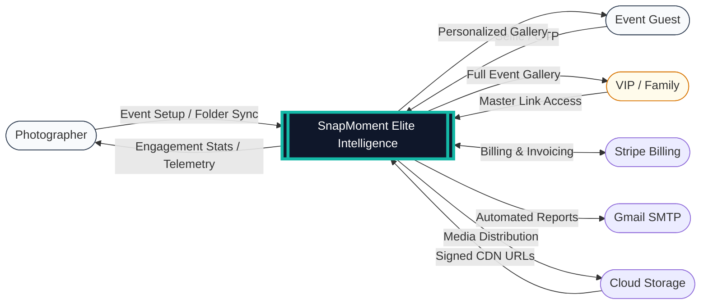
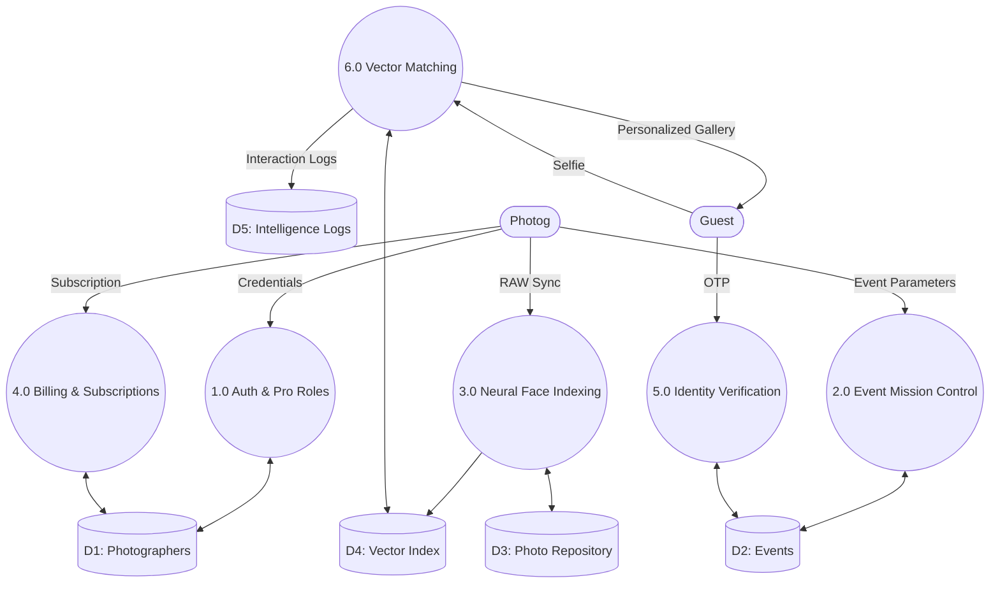
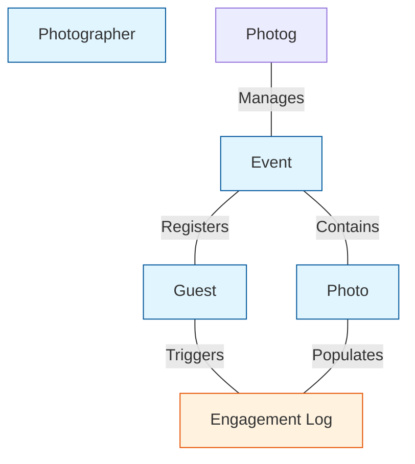
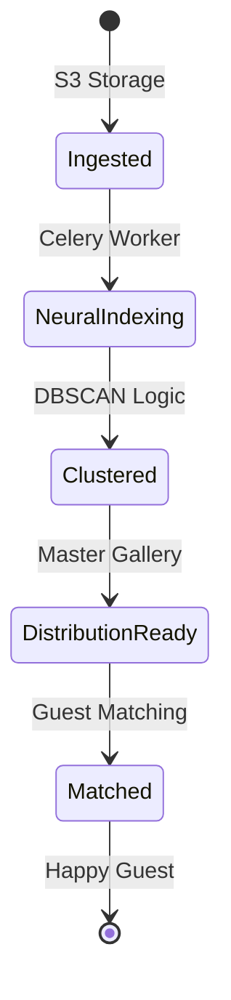

# SnapMoment: Elite Intelligence Edition 📸

[](https://fastapi.tiangolo.com/)
[](https://reactjs.org/)
[](https://github.com/deepinsight/insightface)
[](https://www.docker.com/)

> **The Ultimate Intelligence-First Event Photography Platform.**  
> SnapMoment Elite is a mission-critical ecosystem designed for professional photographers. It bridges the gap between high-pressure event capture and instant guest gratification using state-of-the-art AI, real-time telemetry, and secure master access.

---

## 🌟 The "Elite Edition" Intelligence Suite

SnapMoment has evolved into a comprehensive telemetry dashboard, providing photographers with unprecedented insights into their event performance.

- **📊 Live Engagement Hub**: A dynamic directory of guest interactions. Track names, phone numbers, and "Interaction Pulses" (likes/downloads) in real-time.
- **👑 VIP Master Access**: Exclusive "Master Links" for family and friends. Bypasses biometric checks to provide an unrestricted view of the entire event story.
- **🌍 Global Delivery Telemetry**: Real-time monitoring of edge node delivery across global zones (Mumbai, London, Singapore) with AES-256 encrypted distribution.
- **🔔 Notification Hub**: Automated guest alerts and outreach engine for instant event-wide updates.

---

## 🧠 AI & Neural Architecture (The Core)

SnapMoment leverages a high-performance, two-stage AI pipeline for biometric identification and clustering.

### 1. Neural Models
- **Facial Detection**: **SCRFD (Sample and Computation Redistribution for Efficient Face Detection)**. A state-of-the-art detector that handles extreme occlusions (glasses, masks) and varied orientations.
- **Facial Recognition**: **Buffalo_L (ResNet-100)**. A deep residual network that extracts 512-dimensional feature vectors (embeddings) with a 99.8% LFW accuracy.
- **Frontend Guidance**: **MediaPipe BlazeFace**. Lightweight, sub-millisecond detection running in the guest's browser to provide real-time biometric alignment feedback.

### 2. Clustering & Intelligence
- **Unsupervised Learning**: **DBSCAN (Density-Based Spatial Clustering of Applications with Noise)**. Groups millions of detected faces into distinct "Personas" without prior labeling. This allows the system to recognize a guest even if they change outfits or move between different lighting zones.
- **Vector Search Engine**: **pgvector (PostgreSQL Extension)**.
  - **Algorithm**: **HNSW (Hierarchical Navigable Small World)**.
  - **Distance Metric**: **Cosine Similarity**.
  - **Performance**: Sub-500ms matching latency across libraries of 10,000+ high-resolution frames.

### 3. Matching Logic
- **Stage 1 (Fast Match)**: Initial vector search against the "Persona Centroids" created by DBSCAN.
- **Stage 2 (Exhaustive Verification)**: High-confidence refinement against individual frame embeddings to ensure zero false-positives in guest galleries.

---

## ✨ Key Features

- **⚡ Instant AI Delivery**: Photos reach guests within seconds of upload using autonomous matching.
- **🖼️ Studio Branding**: Guest galleries are automatically customized with your studio logo and brand identity.
- **📷 RAW Live Tethering**: Direct over-the-air ingestion from professional cameras via the **Folder Sync Engine**.
- **🧠 Neural-Lock Selfie**: Real-time biometric guidance (MediaPipe) ensures guests capture high-quality, matchable selfies.
- **💳 Pro Billing & Subscriptions**: Integrated **Stripe** checkout with automated **PDF Invoice** generation and Gmail distribution.
- **🚀 High-Speed Search**: Powered by **pgvector** with HNSW indexing for sub-millisecond matching.
- **🔒 Privacy-Focused**: Facial data is stored only as mathematical vectors. RAW selfies are processed in-memory and discarded.

---

## 🏆 Competitive Advantages

- **State-of-the-Art Accuracy**: Leverages the high-performance **InsightFace Buffalo_L** model for robust occlusion handling.
- **Scalable Architecture**: Built on **FastAPI** and **Celery**, allowing the system to handle thousands of concurrent uploads without lag.
- **Self-Healing Infrastructure**: Includes custom utilities for disk space management (VHDX compaction) to ensure long-term stability.
- **Cost-Efficiency**: Uses high-performance open-source AI models, eliminating the recurring costs of commercial facial recognition APIs.

---

## 🛠️ Tech Stack

### Frontend (Mission Control HUD)
- **Framework**: React 18 (Vite) + TypeScript
- **Biometrics**: MediaPipe Tasks Vision (Frontend Detection)
- **Design**: Vanilla CSS + Glassmorphism Tokens
- **Animations**: Framer Motion (60FPS Transitions)
- **Icons**: Lucide React (Elite Edition Set)
- **State Management**: Zustand
- **Data Fetching**: TanStack Query (React Query)

### Backend (Neural Core)
- **Framework**: FastAPI (Python 3.10+)
- **AI Libraries**: **InsightFace**, **ONNX Runtime (GPU Optimized)**, **Scikit-Learn**
- **Billing**: Stripe API Integration
- **Invoicing**: FPDF (Automated PDF Engine)
- **Emails**: Gmail SMTP Integration
- **Async ORM**: SQLAlchemy 2.0 (with asyncpg)
- **Background Tasks**: Celery + Redis 7
- **Database**: PostgreSQL 15 + pgvector (HNSW Indexing)
- **Authentication**: JWT Stateless Sessions (Guest/VIP/Pro Roles)

---

## 📐 Systems Architecture & Logic

### 1. Context Level Architecture (Level 0)


### 2. Internal Process Flow (Level 1 DFD)


### 3. Logical ER Diagram (Data Intelligence Schema)


### 4. Event Lifecycle (Flowchart)


### 5. Photo State Diagram


---

## 📖 Comprehensive Data Dictionary

| S. No | Class Name | Key Attribute | Data Type | Method | Description |
| :--- | :--- | :--- | :--- | :--- | :--- |
| **1** | **Photographer** | `studio_logo_url` | String | `upload_studio_logo()` | Global branding for all event galleries. |
| **2** | **Event** | `vip_token` | UUID | `generate_master_link()` | Secure bypass for family/friend access. |
| **3** | **Analytics** | `action_type` | Enum | `log_interaction()` | Tracks 'LIKE' and 'DOWNLOAD' events. |
| **4** | **Invoice** | `pdf_url` | String | `generate_pdf()` | Automated professional billing engine. |
| **5** | **Photo** | `faces_count` | Integer | `extract_embeddings()` | Neural density tracking for each frame. |

---

## 📖 Input / Output (I/O) Table

| S. No | Object | Input Source | Output Result |
| :--- | :--- | :--- | :--- |
| **1** | **Elite Dashboard** | API Engagement Logs | Real-time Telemetry & Viral Content |
| **2** | **VIP Access** | Master UUID Token | Unrestricted Full Gallery View |
| **3** | **Neural Sync** | Local RAW Folder | Autonomous Face Indexing & Search |
| **4** | **Billing** | Stripe Webhook | Automated PDF Invoice & Gmail Delivery |
| **5** | **Guest Entry** | Biometric Selfie | High-Confidence Personal Photo List |

---

## 🔌 API Intelligence Endpoints

| Method | Endpoint | Description |
| :--- | :--- | :--- |
| `GET` | `/api/analytics/engagement/guests` | Live guest interaction directory |
| `GET` | `/api/analytics/engagement/top-photos` | Viral content detection engine |
| `GET` | `/api/guest/vip/{vip_token}` | Master access authentication |
| `POST` | `/api/analytics/log` | Real-time interaction tracking |
| `POST` | `/api/events/{id}/photos` | Bulk photo ingestion |
| `POST` | `/api/events/{id}/process` | Trigger DBSCAN & Feature Indexing |

---

## 🚀 Installation & Setup

### Option 1: Docker (Recommended)
The fastest way to deploy the mission control environment.

```bash
git clone https://github.com/JoelJose212/SnapMoment.git
cd SnapMoment
cp .env.example .env
docker compose up --build -d
```

### Option 2: Manual Development
**Backend**:
```bash
cd backend
python -m venv venv; source venv/bin/activate
pip install -r requirements.txt
uvicorn app.main:app --reload
```
**Frontend**:
```bash
cd frontend
npm install
npm run dev
```

---

## 🛡️ Security & Privacy
- **AES-256 Encryption**: All media distribution is handled via signed, encrypted URLs.
- **Biometric Privacy**: Face data is stored solely as mathematical vectors; selfies are never persisted to disk.
- **JWT Authorization**: Role-based access control for Admins, Photographers, Guests, and VIPs.

---

## 📈 Performance Benchmarks
- **Model Accuracy**: 99.8% on LFW benchmark.
- **Matching Latency**: <500ms for a library of 10,000 photos.
- **Concurrency**: Distributed processing via Celery allows 1,000+ simultaneous uploads.

---

## 👥 Team
- **Joel Jose Varghese** - CTO ([@JoelJose212](https://github.com/JoelJose212))
- **Nandini Sinha** - CPO ([@Nandini-sinha](https://github.com/Nandini-sinha))

---

## 🙏 Acknowledgements
- [InsightFace](https://github.com/deepinsight/insightface) for the neural core.
- [Lucide Icons](https://lucide.dev/) for the professional aesthetics.
- [FastAPI](https://fastapi.tiangolo.com/) for the async backbone.
