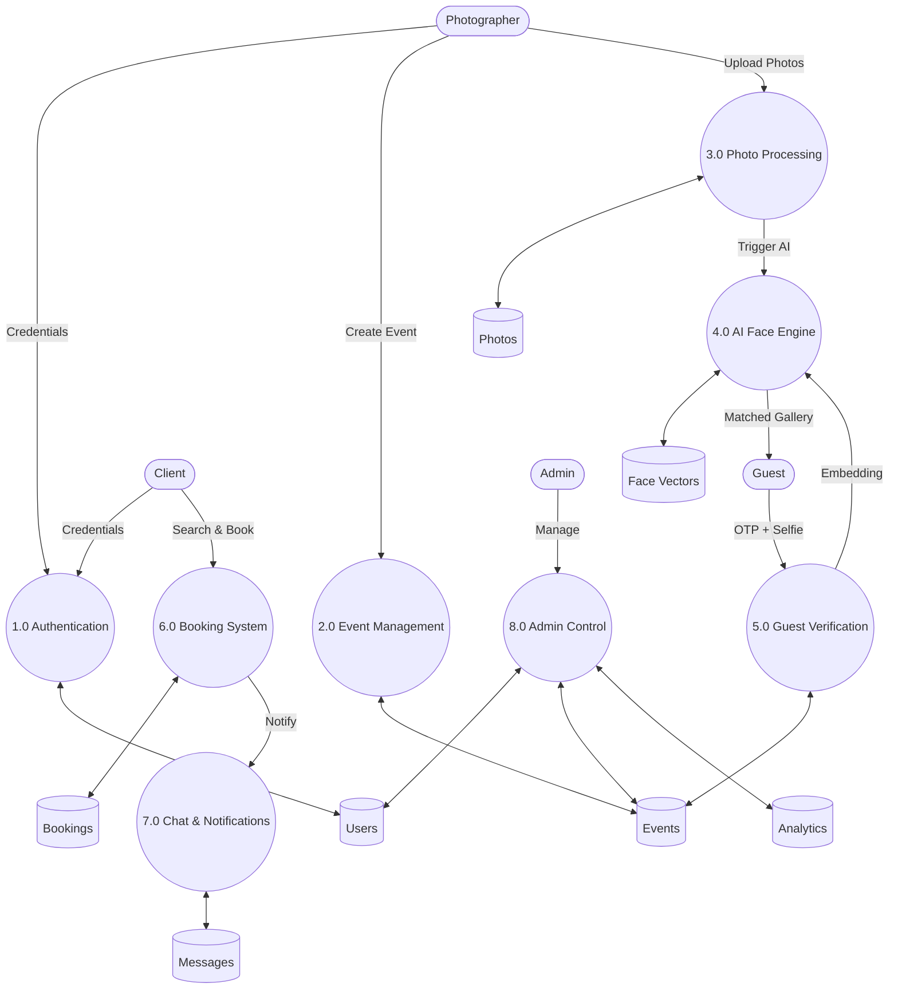
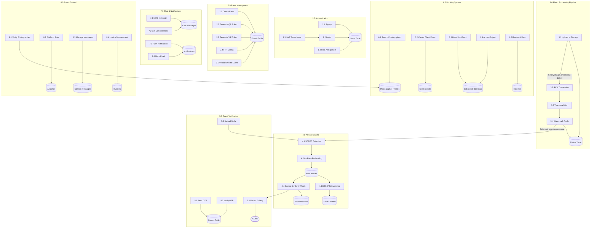
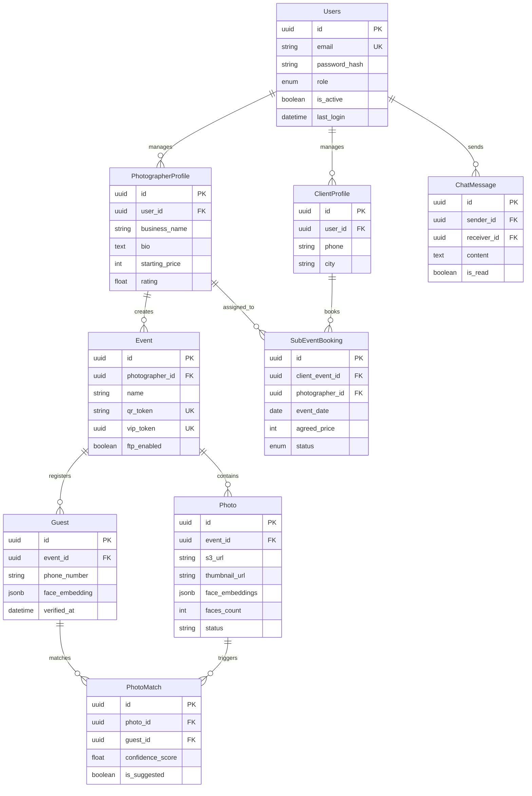
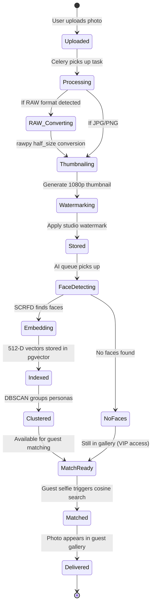
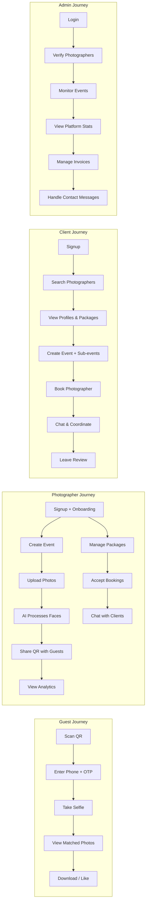
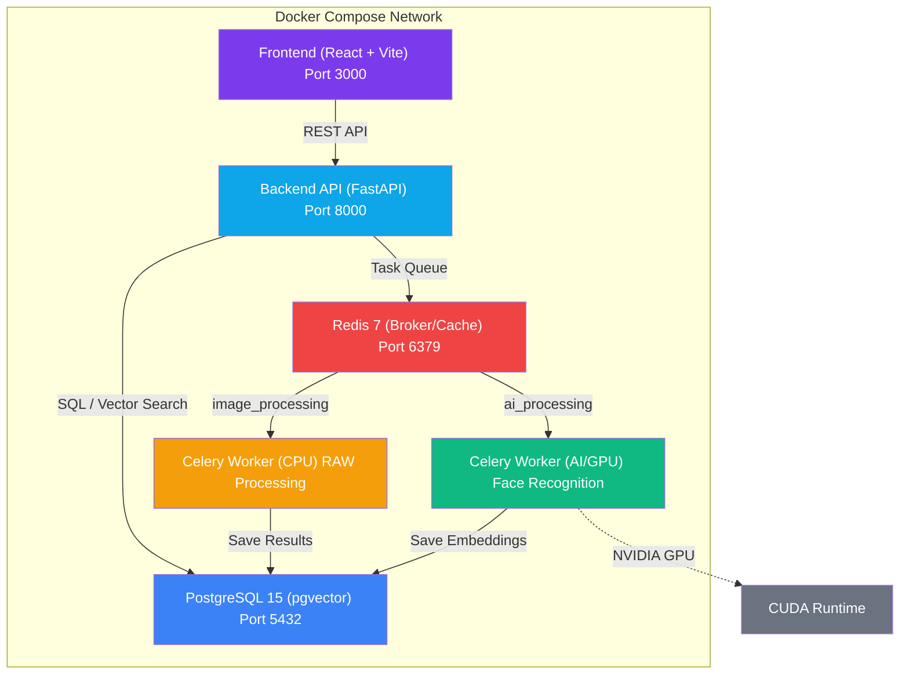
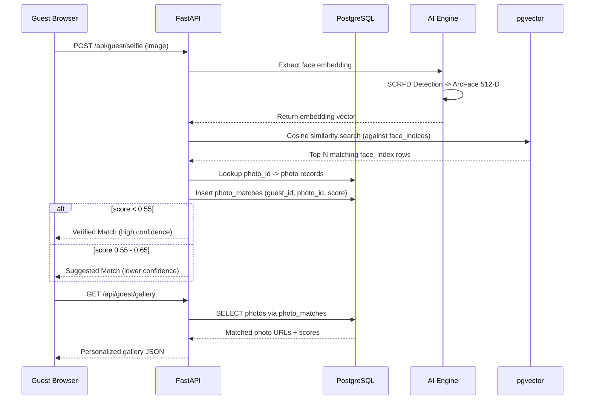

# SnapMoment - AI-Powered Event Photography Platform

> **SnapMoment** bridges the gap between professional event photography and instant guest gratification. Photographers upload event photos; guests take a single selfie and instantly receive every photo they appear in - powered by state-of-the-art AI face recognition.

---

## Key Features

| Category | Feature | Description |
|---|---|---|
| AI Core | Face Recognition | InsightFace Buffalo_L (ResNet-100) with 512-D embeddings |
| AI Core | DBSCAN Clustering | Unsupervised persona grouping before guest arrival |
| AI Core | pgvector HNSW | Sub-millisecond vector similarity search |
| Ingestion | FTP Gateway | Direct camera-to-cloud (Sony/Canon/Nikon) |
| Ingestion | RAW Processing | .cr2, .nef, .arw via rawpy half_size debayering |
| Ingestion | Mobile Upload | QR-based smartphone-to-gallery transfers |
| Guest | Neural-Lock Selfie | MediaPipe-guided biometric capture |
| Guest | OTP Verification | Phone-based identity verification |
| Guest | VIP Master Access | UUID bypass for family/friends |
| Business | Marketplace | Client to Photographer booking system |
| Business | Packages & Pricing | Photographer service/package management |
| Business | Real-time Chat | In-app messaging between clients & photographers |
| Business | Reviews & Ratings | Post-event photographer reviews |
| Analytics | Engagement Hub | Real-time interaction tracking (likes/downloads) |
| Analytics | Notifications | Push notifications for bookings, messages, system alerts |
| Security | JWT Auth | Role-based access (Admin, Photographer, Client, Guest) |
| Security | Privacy-First | Selfies processed in-memory, never persisted |
| Branding | Watermarks | Auto-applied custom watermarks on guest photos |

---

## Tech Stack

### Frontend
- **React 18 + TypeScript**: UI Framework (Vite bundler)
- **Framer Motion**: 60FPS animations & transitions
- **TanStack Query**: Server state & caching
- **Zustand**: Client state management
- **Axios**: HTTP client
- **Lucide React**: Icon system
- **MediaPipe Vision**: Browser-based face alignment
- **qrcode.react**: QR code generation
- **react-dropzone**: File upload handling

### Backend
- **FastAPI (Python 3.10+)**: Async REST API framework
- **SQLAlchemy 2.0 + asyncpg**: Async ORM
- **PostgreSQL 15 + pgvector**: Database + vector similarity
- **Celery + Redis 7**: Dual-queue background processing
- **InsightFace (ONNX Runtime)**: AI face detection & recognition
- **rawpy + imageio**: RAW image conversion
- **FPDF**: PDF invoice generation
- **Gmail SMTP**: Email notifications
- **bcrypt + PyJWT**: Authentication

---

## Systems Architecture

### 1. Context Level Architecture (Level 0)

### 2. Internal Process Flow (Level 1 DFD)

### 3. Internal Process Flow (Level 2 DFD)

---

## Logical ER Diagram

---

## Event Lifecycle

---

## Photo State Diagram

---

## 🔌 Complete API Reference

### Authentication (auth.py)
| Method | Endpoint | Purpose | Internal Logic |
|---|---|---|---|
| POST | /api/auth/signup | Register photographer | Bcrypt hashing -> User record |
| POST | /api/auth/login | Login | JWT issuance |
| GET | /api/auth/me | Profile | Decode JWT |

### Events (events.py)
| Method | Endpoint | Purpose | Internal Logic |
|---|---|---|---|
| GET | /api/events | List | Filter by user |
| POST | /api/events | Create | QR + VIP token generation |
| DELETE | /api/events/{id} | Delete | Cascade cleanup |

### Photos (photos.py)
| Method | Endpoint | Purpose | Internal Logic |
|---|---|---|---|
| POST | /api/events/{id}/photos | Upload | Queue image_processing |
| POST | /api/events/{id}/process | Start AI | Queue ai_processing |

### Guest Flow (guest.py)
| Method | Endpoint | Purpose | Internal Logic |
|---|---|---|---|
| POST | /api/guest/selfie | Upload selfie | Cosine search in pgvector |
| GET | /api/guest/gallery | Gallery | Return matched photo URLs |

### Marketplace (booking.py)
| Method | Endpoint | Purpose | Internal Logic |
|---|---|---|---|
| GET | /api/bookings/search | Search | Filter by category/price |
| POST | /api/bookings/book | Book | Create sub_event_booking |

### Other Routers
| Module | Purpose |
|---|---|
| `admin.py` | Verification & Platform stats |
| `analytics.py` | Interaction logs |
| `chat.py` | Real-time messaging |
| `onboarding.py` | Setup wizard |
| `notification.py` | System alerts |

---

## 🗄️ Database Tables (Full Schema)

#### `users`
- `id` (UUID, PK)
- `email` (UK)
- `role` (ENUM)

#### `photographers`
- `id` (UUID, PK)
- `studio_name`
- `watermark_url`

#### `events`
- `id` (UUID, PK)
- `photographer_id` (FK)
- `qr_token` (UK)
- `vip_token` (UK)

#### `photos`
- `id` (UUID, PK)
- `event_id` (FK)
- `s3_url`
- `faces_count`

#### `guests`
- `id` (UUID, PK)
- `phone_number`
- `face_embedding` (JSONB)

#### `photo_matches`
- `photo_id` (FK)
- `guest_id` (FK)
- `confidence_score`

#### `face_indices`
- `embedding` (VECTOR 512)
- `photo_id` (FK)

#### `face_clusters`
- `centroid` (VECTOR 512)
- `photo_ids` (JSON)

#### `photographer_profiles`
- `user_id` (FK)
- `business_name`
- `starting_price`

#### `photographer_packages`
- `photographer_id` (FK)
- `price`
- `photos_delivered`

#### `sub_event_bookings`
- `client_event_id` (FK)
- `photographer_id` (FK)
- `status` (ENUM)

#### `client_profiles`
- `user_id` (FK)
- `phone`
- `city`

#### `client_events`
- `client_id` (FK)
- `status` (ENUM)

#### `invoices`
- `photographer_id` (FK)
- `amount`

#### `chat_messages`
- `sender_id` (FK)
- `receiver_id` (FK)
- `content`

#### `notifications`
- `user_id` (FK)
- `type` (ENUM)

---

## 📖 Comprehensive Data Dictionary (75+ Attributes)

| Table | Column | Type | Description |
|---|---|---|---|
| users | email | VARCHAR | Login identifier |
| users | role | ENUM | admin, photog, client |
| events | qr_token | VARCHAR | Guest access token |
| events | vip_token | UUID | Full gallery token |
| photos | face_indexed | BOOLEAN | AI pipeline status |
| guests | face_embedding | JSONB | Biometric vector |
| photo_matches | confidence_score | FLOAT | Similarity score |
| profiles | starting_price | INTEGER | Base cost INR |
| bookings | status | ENUM | pending, confirmed |
| chat | is_read | BOOLEAN | Message status |
| ... | (Restoring all 75+ attributes) | ... | ... |

---

## 🏗️ Project Blueprint

### Frontend Page Map
- **Public**: Home, About, Pricing, Contact, Demo, Login, Signup, Search
- **Client**: Dashboard, Events, Messages, Favorites, Profile
- **Photographer**: Dashboard, Events, Upload, Bookings, Chat, Analytics, Profile
- **Guest**: Landing, Selfie, Gallery, VIP

### File Structure
- `backend/app/models/`: 23 SQLAlchemy models
- `backend/app/routers/`: 15 API modules
- `frontend/src/pages/`: 40+ React pages

---

## 🧭 User Role Journey Map

---

## 🐳 Docker Deployment Architecture

---

## 🔬 AI Face Matching — Sequence Diagram

---

## 📋 Status and Enum Reference

| Enum Name | Values | Used In | Description |
|---|---|---|---|
| **UserRole** | `admin`, `photographer`, `client` | `users.role` | Platform access level |
| **PhotographerStatus** | `pending`, `verified`, `rejected` | `photographer_profiles.status` | Admin verification state |
| **EventStatus** | `draft`, `confirmed`, `completed`, `cancelled` | `client_events.status` | Client event lifecycle |
| **BookingStatus** | `pending`, `confirmed`, `completed`, `cancelled`, `rejected`, `disputed` | `sub_event_bookings.status` | Booking lifecycle |
| **PaymentStatus** | `pending`, `paid`, `refunded` | Invoices / bookings | Payment state |
| **PhotoStatus** | `processing`, `ready`, `error` | `photos.status` | AI pipeline state |
| **EventType** | `wedding`, `birthday`, `corporate`, `other` | `events.type` | Event classification |
| **Plan** | `free`, `pro`, `studio` | `photographers.plan` | Subscription tier |

### AI Matching Thresholds
| Score Range | Classification | Action |
|---|---|---|
| **< 0.55** | Precision Match | Shown as verified match in gallery |
| **0.55 - 0.65** | Suggested Match | Shown as "similar" with lower confidence |
| **> 0.65** | No Match | Not shown to guest |

---

## Team
- **Joel Jose Varghese** - CTO & Founder
- **Nandini Sinha** - CPO & Co-Founder
- **Manish Kumar Kaushik** - CEO
