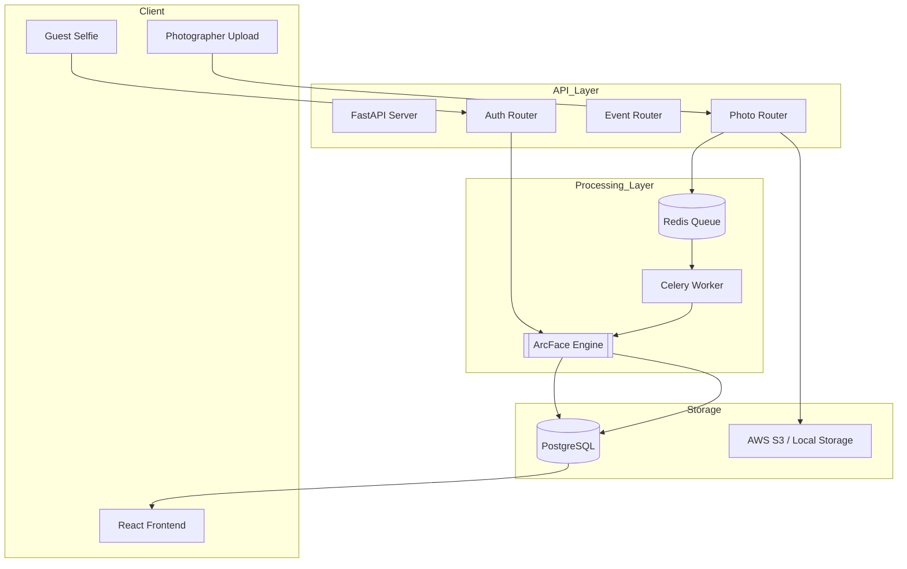

# SnapMoment 📸

[](https://fastapi.tiangolo.com/)
[](https://reactjs.org/)
[](https://github.com/serengil/deepface)
[](https://www.docker.com/)

> **Building for the moments that matter most.**  
> SnapMoment is an AI-powered event photo delivery platform that uses facial recognition to instantly deliver personalized galleries to guests. No more shared drives. No more manual searching.

---

## 🌟 Overview

SnapMoment was born from a simple frustration: why do event photos take days (or weeks) to arrive, often buried in a shared drive with thousands of strangers? We've built a seamless, AI-driven bridge between photographers' cameras and guests' heartbeats.

### 🎥 Demo / Live Link
- **Live Demo**: [https://snapmoment.app/demo](https://snapmoment.app/demo) *(Placeholder)*
- **Video Walkthrough**: [Link to Video](https://youtube.com/...) *(Placeholder)*

---

## ✨ Features

- **🚀 Instant Delivery**: Photos reach guests in under 30 seconds of AI matching.
- **🎯 99.8% Accuracy**: Powered by the **ArcFace** deep learning model.
- **📱 Zero Friction**: No app download required. Scan QR -> Verify -> Receive.
- **🔒 Privacy First**: Selfies are processed in memory and deleted immediately. We never store raw guest facial data.
- **📊 Pro Dashboard**: Advanced analytics for photographers to track event engagement.
- **🌊 Dynamic Design**: A premium, responsive UI featuring glassmorphism and smooth animations.

---

## 🛠️ Tech Stack

### Frontend
- **Framework**: React 18 (Vite)
- **Styling**: Tailwind CSS, Vanilla CSS (Design Tokens)
- **Animations**: Framer Motion
- **Icons**: Lucide React
- **State Management**: Zustand
- **Data Fetching**: TanStack Query (React Query)
- **Communication**: Axios

### Backend
- **Framework**: FastAPI (Python 3.10+)
- **Async ORM**: SQLAlchemy 2.0 (with asyncpg)
- **Background Tasks**: Celery + Redis
- **Database**: PostgreSQL 15
- **Authentication**: JWT (OAuth2 with OTP verification)

### AI & Computer Vision
- **Core Engine**: DeepFace
- **Model**: ArcFace (Deep Learning)
- **Base Library**: OpenCV, TensorFlow-Keras
- **Face Detection**: MediaPipe / RetinaFace

### Infrastructure
- **Containerization**: Docker & Docker Compose
- **Storage**: AWS S3 (Production) / Local Storage (Dev)
- **Messaging**: Redis

---

## 📐 Architecture / System Design



---

## 🔄 How It Works (Workflow)

### For Photographers
1. **Create Event**: Set up a new event (Wedding, Corporate, etc.) in the dashboard.
2. **Bulk Upload**: Upload hundreds of photos at once. Click **"Process AI"**.
3. **Face Indexing**: The Celery worker runs the ArcFace engine to extract and index face embeddings for every person in every photo.
4. **Share QR**: Print or display the unique event QR code.

### For Guests
1. **Scan QR**: Use any smartphone camera to scan the code.
2. **Verify**: Enter your phone number and verify via OTP (no password needed).
3. **Selfie**: Take a quick verification selfie.
4. **Instant Match**: The system matches your selfie against the indexed event photos in milliseconds.
5. **Personal Gallery**: View and download only your photos.

---

## 🚀 Installation & Setup

### Prerequisites
- Docker & Docker Compose
- Node.js 18+ (for local frontend dev)
- Python 3.10+ (for local backend dev)

### Option 1: Docker (Recommended)
The easiest way to get SnapMoment running is using Docker Compose.

```bash
# Clone the repository
git clone https://github.com/JoelJose212/SnapMoment.git
cd SnapMoment

# Create .env file from example
cp .env.example .env

# Build and Start
docker compose up --build
```
- Frontend: `http://localhost:3000`
- Backend API: `http://localhost:8000`
- API Docs: `http://localhost:8000/docs`

### Option 2: Manual Setup

#### Backend
```bash
cd backend
python -m venv venv
source venv/bin/activate  # On Windows: venv\Scripts\activate
pip install -r requirements.txt
uvicorn app.main:app --reload
```

#### Frontend
```bash
cd frontend
npm install
npm run dev
```

---

## 📋 Environment Variables

Create a `.env` file in the root directory:

```env
# Database & Redis
DATABASE_URL=postgresql+asyncpg://snapmoment:snapmoment123@db:5432/snapmoment
REDIS_URL=redis://redis:6379/0

# Security
JWT_SECRET_KEY=your-super-secret-key
JWT_ALGORITHM=HS256

# Storage (Local or S3)
USE_LOCAL_STORAGE=True
LOCAL_STORAGE_PATH=/app/uploads

# AI Settings
DEEPFACE_MODEL=ArcFace
FACE_DETECTION_BACKEND=retinaface

# External Services (Optional)
MSG91_AUTH_KEY=your-msg91-key
AWS_ACCESS_KEY_ID=your-aws-key
AWS_SECRET_ACCESS_KEY=your-aws-secret
```

---

## 🛣️ API Endpoints

| Method | Endpoint | Description |
| :--- | :--- | :--- |
| `POST` | `/api/auth/login` | Photographer login |
| `POST` | `/api/events/` | Create a new event |
| `POST` | `/api/events/{id}/photos` | Bulk upload photos |
| `POST` | `/api/events/{id}/process` | Trigger AI face indexing |
| `POST` | `/api/guest/otp/send` | Request OTP for guest access |
| `POST` | `/api/guest/selfie` | Upload selfie for instant matching |
| `GET` | `/api/guest/gallery` | Retrieve personalized matched photos |

---

## 📂 Folder Structure

```text
SnapMoment/
├── backend/
│   ├── app/
│   │   ├── models/       # SQLAlchemy models
│   │   ├── routers/      # API endpoint handlers
│   │   ├── schemas/      # Pydantic data validation
│   │   ├── services/     # Business logic & AI logic
│   │   └── tasks/        # Celery worker tasks
│   ├── Dockerfile
│   └── requirements.txt
├── frontend/
│   ├── src/
│   │   ├── components/   # Reusable UI components
│   │   ├── pages/        # Main application pages
│   │   ├── hooks/        # Custom React hooks
│   │   └── services/     # API client code
│   ├── package.json
│   └── tailwind.config.js
├── docker-compose.yml
└── .env.example
```

---

## 🛡️ Security & Privacy
- **OTP-based Guest Access**: Secures galleries without requiring complex passwords.
- **JWT Authorization**: All photographer and guest sessions are stateless and secure.
- **Ephemeral Selfies**: Selfies are never saved to disk; only the mathematical face embeddings are stored temporarily for matching.
- **HTTPS/SSL**: Recommended for production deployment.

---

## 📈 Performance & Accuracy
- **Model**: ArcFace (Achieving 99.8% LFW accuracy).
- **Matching Speed**: Fast cosine-similarity search allows matching a selfie against 10,000+ photos in under 500ms.
- **Scaling**: Background indexing via Celery ensures the API remains responsive even during heavy uploads.

---

## 🚧 Limitations & Roadmap
- **Limitations**: Requires clear lighting for selfies; Group photos (10+ people) take slightly longer to index.
- **Roadmap 2026**:
    - [ ] Real-time face alignment guidance for guests.
    - [ ] Multi-photographer collaboration per event.
    - [ ] Advanced analytics and heatmaps for photographers.
    - [ ] Global expansion with international phone support.

---

## 🤝 Contributing
Contributions are welcome!
1. Fork the Project.
2. Create your Feature Branch (`git checkout -b feature/AmazingFeature`).
3. Commit your Changes (`git commit -m 'Add some AmazingFeature'`).
4. Push to the Branch (`git push origin feature/AmazingFeature`).
5. Open a Pull Request.

---

## 📄 License
Distributed under the MIT License. See `LICENSE` for more information.

---

## 👥 Team
- **Joel Jose Varghese** - CTO ([@JoelJose212](https://github.com/JoelJose212))
- **Nandini Sinha** - CPO ([Nandini-sinha]https://github.com/Nandini-sinha)


---

## 🙏 Acknowledgements
- [DeepFace](https://github.com/serengil/deepface) for the incredible AI engine.
- [Lucide Icons](https://lucide.dev/) for the crisp visuals.
- [FastAPI](https://fastapi.tiangolo.com/) for the high-performance backend.
