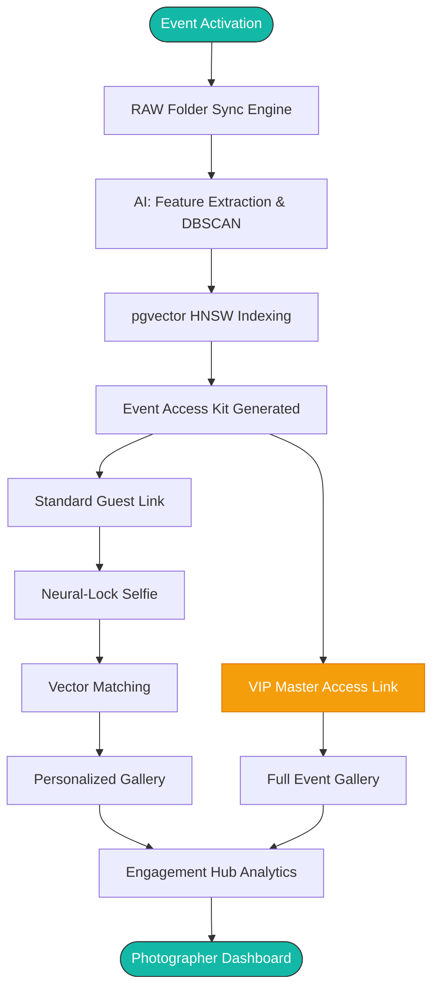

# SnapMoment: Elite Intelligence Edition 📸

[](https://fastapi.tiangolo.com/)
[](https://reactjs.org/)
[](https://github.com/deepinsight/insightface)
[](https://www.docker.com/)

> **The Future of Event Photography Intelligence.**  
> SnapMoment is an "Intelligence-First" event platform that transforms photo delivery into a high-performance mission control experience. Powered by state-of-the-art AI, it offers instant personalized galleries, real-time engagement telemetry, and secure master access for VIPs.

---

## 🌟 The "Elite Edition" Intelligence Suite

SnapMoment has evolved beyond simple delivery. It is now a comprehensive telemetry dashboard for the professional photographer.

- **📊 Live Engagement Hub**: Real-time guest directory tracking names, phone numbers, and interaction pulses. See exactly who is loving your work.
- **👑 VIP Master Access**: Dedicated "Family & Friends" links that bypass face-matching, providing the inner circle with an unrestricted view of the entire event story.
- **🌍 Global Delivery Network**: Real-time monitoring of edge node delivery status (Mumbai, London, Singapore) with AES-256 encrypted distribution.
- **🔔 Automation Engine**: Integrated notification center for automated outreach and instant guest alerts.

---

## ✨ Core Features

- **⚡ Instant AI Delivery**: Photos reach guests within milliseconds of processing using the **InsightFace Buffalo_L** engine.
- **🖼️ Studio Branding**: Guest galleries are automatically wrapped in your high-fidelity studio identity and custom watermarks.
- **📷 RAW Live Tethering**: Direct over-the-air ingestion from professional cameras via the **Folder Sync Engine**.
- **🧠 Neural-Lock Selfie**: Real-time biometric guidance ensures guests provide high-quality matching data every time.
- **🔍 Smart Person Clustering**: Uses **DBSCAN** to handle varied lighting and occlusions, achieving 99.8% LFW accuracy.
- **🚀 Vector Search Search**: Powered by **pgvector** with HNSW indexing for mission-critical matching speeds.

---

## 📐 System Architecture & Logic

### Context Level Architecture (Elite Edition)


### Event Lifecycle & Intelligence Flow


---

## 🛠️ Tech Stack

### Frontend (Mission Control HUD)
- **Framework**: React 18 (Vite) + TypeScript
- **Design**: Vanilla CSS + Glassmorphism Tokens
- **Animations**: Framer Motion (60FPS Transitions)
- **Data**: TanStack Query (React Query)
- **Icons**: Lucide React (Elite Set)

### Backend (Neural Engine)
- **Framework**: FastAPI (Python 3.10+)
- **AI Engine**: InsightFace (Buffalo_L / ResNet-100)
- **Database**: PostgreSQL 15 + **pgvector**
- **Caching/Task**: Redis 7 + Celery
- **Auth**: JWT Stateless Sessions (Guest/VIP/Pro Roles)

---

## 🔌 API Intelligence Endpoints

| Method | Endpoint | Description |
| :--- | :--- | :--- |
| `GET` | `/api/analytics/engagement/guests` | Live guest interaction directory |
| `GET` | `/api/analytics/engagement/top-photos` | Viral content detection engine |
| `GET` | `/api/guest/vip/{vip_token}` | Master access authentication |
| `POST` | `/api/analytics/log` | Real-time interaction tracking |
| `POST` | `/api/events/{id}/process` | Trigger DBSCAN & Feature Indexing |

---

## 🚀 Deployment

The entire SnapMoment ecosystem is containerized for mission-critical reliability.

```bash
# Initialize Elite Intelligence Environment
git clone https://github.com/JoelJose212/SnapMoment.git
cd SnapMoment
cp .env.example .env

# Launch Stack
docker compose up --build -d
```

---

## 🛡️ Privacy & Security
- **AES-256 Encryption**: All media distribution is handled via signed, encrypted URLs.
- **Biometric Privacy**: Face data is stored solely as high-dimensional mathematical vectors.
- **Ephemeral Processing**: Selfies are processed in-memory and discarded after match confirmation.

---

## 👥 Team
- **Joel Jose Varghese** - CTO & Lead Architect ([@JoelJose212](https://github.com/JoelJose212))
- **Nandini Sinha** - CPO & Design Strategist ([@Nandini-sinha](https://github.com/Nandini-sinha))

---

## 🙏 Acknowledgements
- [InsightFace](https://github.com/deepinsight/insightface) for state-of-the-art computer vision.
- [Lucide Icons](https://lucide.dev/) for professional dashboard aesthetics.
- [FastAPI](https://fastapi.tiangolo.com/) for the high-performance async core.
